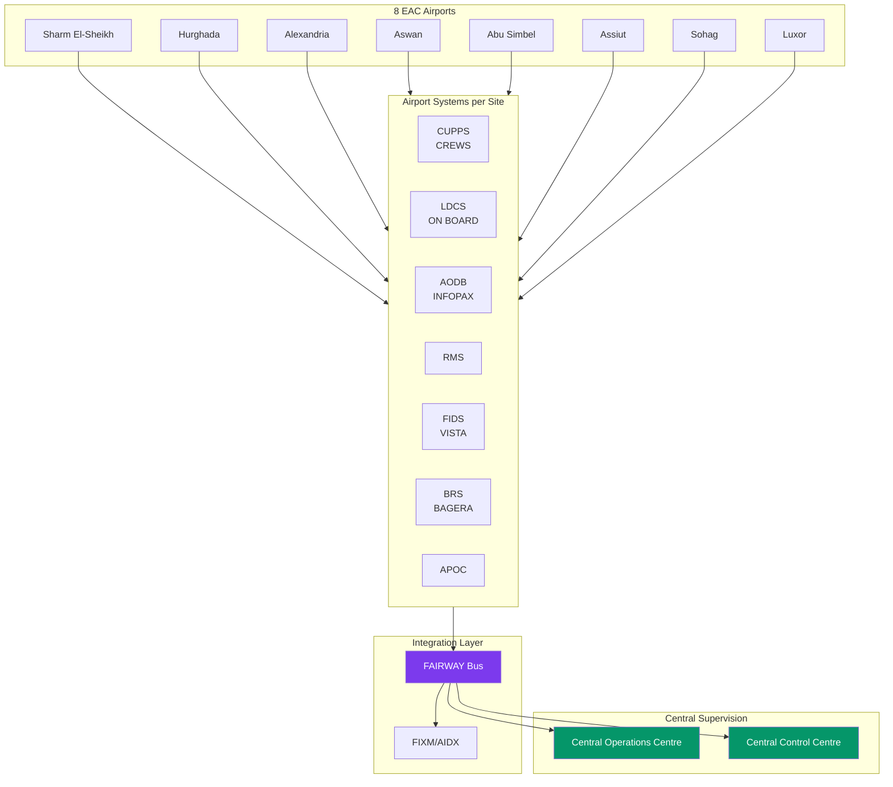

## RFP Technical Requirements Overview

The Egyptian Airports Company (EAC) Request for Proposal covers integrated airport systems across 8 airports with central supervision.

**Key Requirements:**
- Multi-airport deployment with stand-alone sites and central supervision
- High availability with redundant infrastructure (2 core rooms per airport)
- IATA compliance: CUPPS (RP1797), CUTE/CUSS, IATA AHM 730
- 24/7 operations with 99.9% availability
- Integration with airlines, ANSP, ground handling, security
