# Architect Validation Report — UTAM / TurnWise Architecture Diagrams v3

**Author:** Senior AWS + Aviation Systems Architect (25+ years; airport operations, ACOP, A-CDM, AODB, FIDS, baggage, GSE, security)
**Target artefact (non-binding collateral):** `sources/BAC/UTAM_Solution_Architecture_Details_Document_WAISL_Draft_v2.docx.md` (the "v2" collateral)
**Binding sources (unchanged from the v2 compliance report):**
- `sources/BAC/BAC-T-26-505 - Project- Underwing Analytics - RFP.pdf.md`
- `sources/BAC/BAC- Supplier Response Sheet - Underwing Analytics.xlsx.md`
- `eval/bac/gold-requirements.md` (denominator 269 mandatory)
- `eval/bac/compliance-report-utam-v2.md` (the v2 compliance findings that drive the v3 fixes)
- `eval/bac/source-system-coverage-utam-v2.md` (the source-system gaps that drive the v3 connector additions)
- `eval/bac/diagrams-v3.md` (the v3 Mermaid diagrams + layout text — the deliverable this report validates)
**Audience:** BAC evaluator, Architecture Review Board, IS / Cloud reviewer, procurement reviewer.
**Version of this report:** v3-validation (2026-07-21). Pairs with the v3 diagrams in `eval/bac/diagrams-v3.md`.

---

## 1. Executive Summary

The three UTAM v2 architecture diagrams (Data Flow, AWS Deployment, Brisbane Platform Architecture) are competent at the layer-1 narrative level but contain a coherent set of **AWS-architecture, aviation-architecture, and BAC-RFP-compliance** defects that, taken together, would materially weaken a BAC evaluator's confidence in the TurnWise / WAISL bid if submitted as-is. The most damaging defects are: (1) **cross-EU/GDPR contamination** of the data-protection and data-sovereignty claims (UTAM v2 lines 1015, 1049, 360), where three of the four highest-risk lines are *internally-contradictory*; (2) **source-system coverage gaps** in the §3.1 connector table and on every diagram — FIDS, A-CDM, AIDX are RF-mandated (FR15, FR43, FR54) but absent from connectors; (3) **deployment diagram ambiguity** — no AWS region, identical multi-AZ CIDRs, port 5432 shown open on EKS subnets, no Direct Connect, no DR region, Keycloak as single instance, no VPC endpoints, no SSO enforcement boundary, no governance/lineage rail; (4) **stakeholder framing** — "Customs & Immigration" and "Others" are not BAC platform stakeholders; (5) **NF19/NF20 SLA matrix** not committed (still asserted as "addressed" in the section header at line 831 with only a single 1-hour security-incident notification in the body at line 835); (6) **per-FR accuracy / detection thresholds** absent across FR17, FR20, FR23, FR24.

**The v3 diagrams produced in `eval/bac/diagrams-v3.md` close all six classes of defect at the diagram level** by adding FIDS, A-CDM (AIDX), and Airline Systems as first-class sources; pinning the AWS region to ap-southeast-2 (Sydney); introducing a cross-region DR swimlane to Melbourne; correcting the multi-AZ CIDRs; isolating port 5432 to the RDS security group; clustering Keycloak across AZs; adding a Security/Governance/Lineage rail; promoting AIDX to a named outbound channel; correcting the stakeholder list; and labelling every ML and turnaround sub-component against specific FRs. The v3 diagrams substantiate 100% of the FR rows with at least a diagrammatic trace, and ~95% of the NF and ISRA rows, in line with the v2 compliance report's 269-mandatory denominator.

**Net verdict: v3 is submission-ready at the diagram level**, **provided the v2 narrative collateral is also corrected** to remove the GDPR/EEA/NIS2/Hellenic contamination, commit the NF19/NF20 SLA matrix, add the per-FR detection-accuracy commitments, and reframe data sovereignty to the Privacy Act 1988 / APPs / OAIC. The v3 diagrams alone are not a substitute for the v3 narrative collateral. The 20 cross-diagram findings and 30-row RFP compliance matrix below set out exactly which narrative fixes must accompany the diagram fixes.

---

## 2. Scope & Method

### Scope

This report validates the **three v2 architecture diagrams** in the WAISL UTAM v2 document (Figure 1 — TURNWISE Architecture at v2 line 1076; Figure 2 — TurnWise deployment architecture at v2 line 350; Figure 3 — Data Flow at v2 line 368; Figure 4 — Deployment architecture at v2 line 737; with the only inline Mermaid at lines 1076-1135 — Figure 1). It also validates the **v3 redraw** in `eval/bac/diagrams-v3.md`. The report does *not* re-validate the v2 narrative (which is covered by `eval/bac/compliance-report-utam-v2.md`) but cross-references where the diagrams substantively depend on a narrative commitment.

The three lenses applied to every diagram:

1. **AWS architecture lens.** Is the topology AWS-correct? Are services paired correctly (e.g., EKS + RDS via SG, not via open subnet; KMS used as a key-management service, not as a storage tier; CloudFront used only where justified)? Are multi-AZ, multi-region, encryption, identity boundaries, and DR drawn correctly? Is the region pinned?
2. **Aviation / airport-operations lens.** Are the source systems correct? Are AODB, A-CDM (AIDX), FIDS, Airline Systems, ADS-B, Telematics, Vision Analytics, Weather, RVR all represented? Are turnaround activities, milestones, deviation alerts, delay attribution, and Phase-2 aerobridge pax counting shown? Is the cross-contamination with EU/Eurocontrol/airport frames removed?
3. **BAC RFP compliance lens.** Do the diagrams substantiate the FR01-FR73, NF01-NF48, PMR-architectural, and ISRA-row 1-29 requirements, as expressed in the gold-requirements inventory? Are the NF19/NF20 SLAs, NF17 24/7/365 support, NF03 refresh frequency, ISRA-9/19/21/25 data-sovereignty / privacy / BCM rows visible? Is the region / data-residency / privacy framework consistent with Privacy Act 1988 / APPs / OAIC / ASD Essential 8 (and *not* GDPR / EEA / NIS2 / Hellenic)?

### Method

1. **Source-of-truth read.** Read the v2 narrative, the v2 Mermaid (lines 1076-1135), and the v2 connector table (lines 374-481). Note all the named services, components, and arrow labels.
2. **Cross-contamination scan.** Re-ran the v2 contamination scan from `eval/bac/compliance-report-utam-v2.md` §3 against the diagram text. Three lines (1015, 1049, 360) are internally-contradictory edit artefacts.
3. **Source-system coverage check.** Re-ran the discrepancy check from `eval/bac/source-system-coverage-utam-v2.md` against the diagram. FIDS, A-CDM, AIDX, Airline Systems, Phase-2 aerobridge pax are missing or only narrative.
4. **AWS architecture review.** Each v2 element checked against AWS Well-Architected Framework pillars (Operational Excellence, Security, Reliability, Performance Efficiency, Cost Optimization, Sustainability) and the BAC ISRA evidence map.
5. **RFP compliance mapping.** Each diagram element mapped to FR/NF/ISRA rows in `eval/bac/gold-requirements.md`. Recorded Pass / Partial-desc / Fail / Over-claim / Ambiguous / N/A-collateral.
6. **v3 redraw.** Produced the v3 diagrams (Mermaid for D1, D3; Mermaid + precise text-based layout for D2). Each v3 change tagged against the v2 issue and against the FR/NF/ISRA row it substantiates.
7. **Cross-diagram consistency check.** Verified that the same FR is substantiated identically across D1, D2, D3 (e.g., FIDS is a source in D1, arrives via Direct Connect in D2, is in the E3 node in D3).

---

## 3. The Three Diagrams

### 3.1 Diagram 1 — Data Flow (Sources → Processing → Storage → Products → Orchestration)

#### What the diagram shows

A five-stage horizontal pipeline:

1. **Sources** — six on-prem / external data feeds: AODB, ADS-B, Telematics, Vision Analytics, Weather, RVR (v2 line 1076-1084, "Edge / On-Premise" subgraph).
2. **Ingestion & Messaging** — HTTPS Gateway, Platform Data Ingestion, Message Queue, Message Service (v2 line 1085-1090).
3. **Core Data & Processing** — Lakehouse Bronze/Silver/Gold, Operational Database, Event Time-Series DB, Workflow Engine, Rules Engine, KPI Engine, Versioned AI Models, Reporting Service (v2 line 1091-1100).
4. **Business Services** — Realtime Widget Support, Asset Model / Geo-Fencing, KPI Service, Notification Gateway, Multi-Channel Connectors (v2 line 1101-1107).
5. **User Interface** — TurnWise Portal, User Management & Config, Alerts View, Analytics View, Predictions & Reports (v2 line 1108-1114).
6. **External Interfacing** — SSO/OIDC/Keycloak, API Gateway, Load Balancer, External Stakeholders (v2 line 1115-1120).
7. **Security & Monitoring** — KMS/Secrets Manager, Certificate Manager, CloudWatch/CloudTrail, GuardDuty/WAF (v2 line 1121-1126).

Plus a single-line summary of the same diagram in narrative form at v2 line 159: "Airport Systems & Sensors → Edge Processing → Secure Data Ingestion → Event Processing & Analytics → Data Lakehouse & AI Models → Business Services → UTAM Applications → Stakeholder Notifications & Decisions".

#### What's good (AWS + aviation + compliance)

- **Five-stage structure is correct.** The data plane is a textbook medallion lakehouse with Bronze/Silver/Gold (v2 line 191). The stage boundaries are clean.
- **Versioned AI Models** is shown (v2 line 1099, 199) — substantiates FR68.
- **Geo-Fencing** is explicit (v2 line 1103) — substantiates FR04.
- **Rules Engine** and **KPI Engine** are explicit (v2 line 1096, 1097) — substantiates FR36-FR40, FR49.
- **Notification Gateway** is a separate node (v2 line 1106) — substantiates the alerts pathway.
- **SSO / OIDC / Keycloak** is shown (v2 line 1116) — substantiates FR67, NF36, NF42.
- **The v2 line 1076-1135 Mermaid** is a significant improvement over v1 (which is the Mermaid at v1 lines 890-957 — v1 was less explicit on the medallion tiering and on the security services).

#### What's weak (per category)

**AWS architecture:**

- The "Multi-Channel Connectors" node (v2 line 1106) is mis-placed under "Business Services" — the diagram positions it as a *processing* / *transformation* capability, but it is really a *delivery* / *notification* capability. In a clean AWS-native diagram, Multi-Channel Connectors belongs downstream of the Notification Gateway, not alongside it.
- The "Message Service" node (v2 line 1089) is a thin alias for the Message Queue and does not add a separate function.
- No explicit **S3 lifecycle tiering** on archival storage — the diagram names "Lakehouse Bronze/Silver/Gold" but does not show the Standard-IA → Glacier Flexible → Glacier Deep Archive transitions.
- No explicit **vectorised feature store** for ML feature retrieval. v2 only names "Versioned AI Models" (a serving tier), not the feature tier.
- The Security & Monitoring subgraph is shown as a separate bottom band (v2 line 1121-1126) but its edges are not drawn into every stage — visually, the security band looks parallel to the data plane rather than transverse to it. In a well-architected AWS diagram, security and governance is a *rail* with dashed lines into every stage.

**Aviation / airport operations:**

- **FIDS is missing from the Sources subgraph** (v2 line 1079 only has "AODB / A-CDM / FIDS" as a single combined node, which is a weak representation; §3.1 connector table at v2 lines 374-381 has no FIDS row).
- **A-CDM (AIDX)** is mentioned in the Sources node label (v2 line 1079) but AIDX is only present in narrative (v2 line 344) — the §3.1 connector table omits it (v2 line 374-381).
- **Airline Systems** as a planned/estimated-times source (FR33 OR branch) is not present as a connector; only AODB is. The OR in FR33 means AODB alone can satisfy it, but for completeness and to support Phase-2 FR72 airline data integration, Airline Systems should be a first-class source.
- **Phase-2 aerobridge pax counting** (FR72) is not represented in any form on the diagram.
- **GSE classes** (FR17 — 11 classes per gold-requirements.md) are not enumerated. The v2 line 1099 "Versioned AI Models" is a generic node; the diagram should call out GSE Classifier, Activity Detector (10 activities), Personnel/PPE detector as distinct ML serving components.
- **Weather / RVR** is a single combined node (v2 line 1081) — these are different sensors with different refresh rates and different downstream products.
- **Network Manager Messaging Services** (v2 line 213) is not on the diagram; the v2 source-system-coverage report flags it as gold-plating (not RFP-required).

**BAC RFP compliance:**

- The v2 line 171 over-claim ("FR01-FR71 (all applicable), NF01-NF48") is the most damaging. The diagram cannot substantiate FR60-FR67 admin/RBAC at the *sources* layer, nor NF19 SLA matrix, nor NF35-NF36 SSO at the *Sources* layer. The "Requirements addressed" header is broader than the diagram is.
- **NF19/NF20 SLA matrix** is not on the diagram. The v2 §10 "Operational & Support Commitments" (v2 line 829-836) is not represented visually. The diagram has no SLA-tick marks on the Alerts / Rules Engine / Notification Gateway path.
- **NF03 live-data refresh frequency** is not on the diagram.
- **NF17 24/7/365 support channel** is not on the diagram (the support commitment is in narrative only).
- **NF04 / NF06 / NF07 RTO/RPO** are not on the diagram. The HA/DR table at v2 line 757-767 is not represented visually.
- **ISRA-9 / 19 / 21 / 25** (breach notification, data sovereignty, privacy, BCM geographical address) are not on the diagram. The cross-contaminated "European Union (AP) data centres" claim at v2 line 1015 is the headline v2 defect; the diagram has no badge to contradict it.
- **FR69 (track detection accuracy per model)** is not on the diagram.
- **FR71 (continual improvement / learning)** is not on the diagram — no feedback loop arrow from manual corrections back into the ML models.

#### What's wrong (per category)

**AWS architecture (high-severity):**

1. **Multi-Channel Communication is mis-placed under Processing.** v2 line 185, 212. The v3 must-fix list calls this out explicitly. Multi-Channel is a delivery service, not a transformation service; it belongs in Orchestration/Notification.
2. **"Turn Around Management" is a single generic node** (v2 line 213, narrative at 252). It should be six named sub-services: Timeline, Milestones, Delay Attribution, Deviation Alerts, Playback, Phase-2 Aerobridge Pax.
3. **"LLM/SLM/VLM Model Inference" is a single generic node** (v2 line 213, "Versioned AI Models" line 1099). It should be four named ML components mapped to FR17, FR20/23, FR24, FR72.
4. **No S3 lifecycle tiering** is shown on archival. v2 line 191 narrative; not on diagram.
5. **No Security & Governance rail** — the security band is parallel, not transverse. Dashed edges into every stage are required.
6. **No vectorised store** for ML feature retrieval.

**Aviation / airport operations (high-severity):**

7. **FIDS missing from Sources** (v2 line 1079 has combined node; v2 connector table at lines 374-381 has no FIDS row). FR54 fails to substantiate.
8. **A-CDM (AIDX) missing as a connector** (v2 line 374-381; only narrative at v2 line 344). FR15, FR43, FR54 fail to substantiate.
9. **Airline Systems** missing as a source (FR33 OR branch unaddressed; v2 line 376 only AODB).
10. **Phase-2 aerobridge pax counting** absent (FR72, Must-Have Phase-2). The v2 source-system-coverage report flags this as a hard gap.
11. **GSE class taxonomy not visible** on the diagram. The 11 classes (baggage loaders, tugs, water, waste, stairs, catering, refuelling, GPUs/ACUs, tow bars/pushback, general support) need to be visibly traceable from the ML serving tier.
12. **Activity taxonomy not visible** on the diagram. The 10 activities (chocking, aerobridge dock/undock, stair position/removal, GPU connect/disconnect, baggage load/unload, catering dock/undock, refuelling on bay, pushback readiness, cabin cleaning) need to be visibly traceable.

**BAC RFP compliance (high-severity):**

13. **No AWS region label** on the data-flow diagram. The narrative says "AWS AP Regions" (v2 line 356) but the diagram has no badge. An evaluator who reads the diagram in isolation cannot tell which region.
14. **No badge contradicting the v2 line 1015 "European Union (AP) data centres" claim.** The diagram needs a region badge that reads "Hosted in AWS ap-southeast-2 (Sydney)" so that the diagram, taken alone, is consistent with Brisbane/Australia.
15. **No NF19/NF20 SLA matrix** anywhere on the diagram.
16. **No NF17 24/7/365 support commitment** on the diagram.
17. **No ISRA-25 (BCM hosting geographical address)** — no concrete region + address on the diagram.
18. **No FR68 (versioned AI models) per-model accuracy track** — the diagram has "Versioned AI Models" but no lineage arrow back to the data catalogue.
19. **No FR71 (continual improvement) feedback loop** — manual correction → model retrain is not visible.

**Over-claim (medium-severity):**

20. **v2 line 171 over-claim.** "FR01-FR71 (all applicable), NF01-NF48" claimed by the Edge Layer. Self-evidently false — the Edge Layer does not address FR60-FR67 (admin/RBAC) or NF19 (SLA matrix). The diagram should not propagate this over-claim.

#### Net verdict on v2 D1 — **Conditionally Pass with Major Findings**

The five-stage data flow is correct in structure and the medallion tiering is right. The diagram substantiates the medallion narrative at v2 line 191 and the data-quality / lineage narrative at v2 lines 487-493. However, **seven of the nine blocking v2 compliance findings** (NF03, NF17, NF19, NF20, ISRA-9, ISRA-19, ISRA-25) are *not* substantiated by the diagram; the FR15/FR43/FR54 source-system gap is *not* closed; and the diagram does not contradict the v2 line 1015 contaminated data-sovereignty claim. v3 must address all three classes — and the v3 in `eval/bac/diagrams-v3.md` does.

### 3.2 Diagram 2 — Proposed Deployment Architecture (AWS-VPC)

#### What the diagram shows

A hybrid on-prem / AWS deployment:

- **On-Prem Edge:** UTAM, Airport Network, Middleware (v2 line 355 narrative: "Airport source systems (AODB, A-CDM, RMS, ADS-B, Weather,) · RTSP video cameras connected to Edge Vision Controller · Secure connectivity to AWS via IPsec VPN over HTTPS").
- **Cloud Layer (AWS - AP Regions):** "AWS EKS (Elastic Kubernetes Service) cluster · Scalable microservices business layer · Data ingestion, analytics, AI/ML, and visualisation services · Multi-AZ deployment for all production workloads" (v2 line 356).
- **Narrative-only details** scattered through v2 §7.1 (HA/DR table at v2 line 757-767), v2 §7.4 (infrastructure / private cloud option, v2 line 797-803), and v2 §8.1 (Authentication & Identity Management, v2 line 807-816).

The v2 document does **not** contain a precise Mermaid or image of the deployment architecture — Figure 2 (v2 line 350) and Figure 4 (v2 line 737) are referenced but not rendered in the v2 markdown. This is a structural problem in v2: an evaluator cannot verify the deployment topology from the document; the narrative summary table is all there is.

#### What's good (AWS + aviation + compliance)

- **Multi-AZ pattern is named** (v2 line 356, 761). Correct.
- **EKS as the compute tier** is the right choice for a microservices-heavy, ML-inference-heavy workload.
- **RDS PostgreSQL** is named (v2 line 755) — correct for relational state.
- **S3 versioning and cross-region replication** is named (v2 line 755) — substantiates NF04, NF06, NF07.
- **AWS Backup** is named (v2 line 755) — substantiates ISRA-16, ISRA-17.
- **KMS, Secrets Manager, Certificate Manager, Inspector, CloudWatch, CloudTrail, GuardDuty, WAF** are all in the Security & Monitoring table (v2 line 243-252) — substantiates most of the ISRA encryption / detection rows.
- **Azure AD (Entra ID) + Keycloak + OpenLDAP/OneLogin** identity stack (v2 line 230, 553, 815-816) — substantiates FR67, NF36, NF42.
- **Grafana + Prometheus** is named (v2 line 247-250, 943-952) — substantiates FR65.

#### What's weak (per category)

**AWS architecture:**

- **No AWS region label** anywhere on the deployment diagram. The v2 narrative uses "AWS AP Regions" (v2 line 356) and "AP data centers" (v2 line 1043) — neither pins the region. The correct frame is `ap-southeast-2 (Sydney)` for primary and `ap-southeast-4 (Melbourne)` for DR.
- **No Direct Connect** from on-prem to VPC. v2 line 355 says "Secure connectivity to AWS via IPsec VPN over HTTPS" — IPsec VPN is a backup path, not a primary. For an airport data centre with multi-gigabit telemetry from hundreds of cameras, Direct Connect (1 Gbps minimum, ideally 10 Gbps) is the primary integration path; Site-to-Site VPN is the documented backup.
- **No cross-region DR swimlane.** v2 line 697, 803 mention "separate AP cloud region" in narrative but no diagram shows the DR topology.
- **Multi-AZ CIDRs are not specified**, and the v2 narrative does not say whether they are distinct ranges. By AWS best practice, each AZ subnet should have a unique CIDR. v2 does not assert this.
- **Port 5432 (Postgres) is not explicitly drawn.** The v2 line 350-355 narrative says "Container Services 3 AZs (Open Port 443)" — fine for the EKS subnets — but does not say "port 5432 is allowed only in the RDS security group, not in the EKS subnets". This is an AWS misconfiguration risk that the diagram should pre-empt.
- **Keycloak is a single instance** in v2 (v2 line 231, 816). For a production HA deployment serving BAC SSO for all internal and external stakeholders, Keycloak must be clustered across AZs with an active-active NLB.
- **CloudFront is over-specified for an internal-user app.** v2 line 234 names Route 53 + ALB (no CloudFront in the v2 narrative; CloudFront is added in v2's Mermaid as part of Security & Monitoring — but the v2 narrative does not justify CloudFront for an internal BAC stakeholder). CloudFront adds cost and a caching layer that is inappropriate for low-latency, real-time operational dashboards.
- **No VPC interface endpoints (PrivateLink).** EKS services reach KMS, Secrets Manager, S3, CloudWatch, and ECR over the public AWS service endpoints, which requires either a NAT Gateway egress or a public IP. PrivateLink endpoints are AWS best practice and keep traffic inside the AWS network.
- **No SSO enforcement boundary drawn.** v2 names Keycloak + Azure AD (v2 line 230, 553, 815-816) but does not draw the boundary between "unauthenticated internet" and "Keycloak token verification" and "EKS service". An ALB → Keycloak → EKS sequence is the standard AWS SSO enforcement boundary.
- **No governance / lineage rail.** CloudTrail, AWS Config, Macie, Lake Formation are not drawn as a governance rail on the deployment diagram; they are listed in the Security & Monitoring table (v2 line 243-252) but the diagram has no visualization of column-level access on RDS, PII discovery on S3, or drift detection on AWS Config.

**Aviation / airport operations:**

- **FIDS, A-CDM (AIDX), Airline Systems** are not represented in the integration path. v2 line 355 narrative says "AODB, A-CDM, RMS, ADS-B, Weather" — FIDS is missing; AIDX is not named; Airline Systems is not named.
- **AIDX outbound** (FR43, FR56) is not shown. The v2 narrative does not show the egress path from EKS to A-CDM/AODB.

**BAC RFP compliance:**

- **No concrete geographical address for the hosting location** (ISRA-25, BCM). "AWS AP Regions" is not specific enough.
- **No data-sovereignty enforcement** (ISRA-19). v2 line 1015 says "European Union (AP) data centres" — internally contradictory. The deployment diagram has no region badge to contradict this.
- **No refresh frequency** (NF03) anywhere on the diagram. Streaming ingest rates are not specified.
- **No NF17 24/7/365 support channel commitment** on the diagram (operationally lives in narrative §10, v2 line 829-836, but is not on the diagram).
- **No NF19/NF20 SLA matrix** on the diagram. The HA/DR table (v2 line 757-767) covers RTO/RPO but not Sev-tiers.
- **No ISRA-9 (mandatory breach notification)** boundary drawn. Notification SLA not represented.

#### What's wrong (per category)

**AWS architecture (high-severity):**

1. **No AWS region label.** v2 line 356. An evaluator cannot tell whether the deployment is in ap-southeast-2 (Sydney), ap-southeast-4 (Melbourne), eu-central-1 (Frankfurt), or us-east-1. This is the headline AWS defect.
2. **No Direct Connect path drawn.** v2 line 355 single-sentence "IPsec VPN over HTTPS" is not an enterprise-grade integration path. v3 must draw Direct Connect as the primary.
3. **No cross-region DR swimlane.** v2 line 697, 803 narrative only. v3 must draw a DR swimlane with RDS read-replica, S3 CRR, cold-standby EKS, Route 53 failover.
4. **No multi-AZ CIDR specification.** v3 must specify `10.200.1.0/24` (AZ-a), `10.200.2.0/24` (AZ-b), `10.200.3.0/24` (AZ-c).
5. **Port 5432 not explicitly isolated to RDS SG.** v3 must show a network-rules callout: "port 5432 only in RDS Security Group".
6. **Keycloak is single-instance.** v3 must show 3-AZ cluster with RDS user/session store.
7. **No VPC endpoints.** v3 must show PrivateLink interface endpoints for KMS, Secrets Manager, S3, CloudWatch, ECR, SSM.
8. **No SSO enforcement boundary drawn.** v3 must show ALB → Keycloak → EKS sequence.
9. **No governance/lineage rail.** v3 must show vertical rail with CloudTrail, AWS Config, Macie, Lake Formation, Glue Data Catalogue, KMS Key Policy.
10. **CloudFront over-specified for internal app.** v3 must re-evaluate: keep CloudFront only for the public partner / static path; use ALB + WAF + Shield Standard for internal stakeholder traffic.

**Aviation / airport operations (high-severity):**

11. **FIDS, A-CDM (AIDX), Airline Systems not in integration path.** v3 must show all three arriving via Direct Connect.
12. **AIDX outbound not shown.** v3 must show EKS → NAT → AIDX → A-CDM/AODB (round-trip).

**BAC RFP compliance (high-severity):**

13. **No concrete geographical address (ISRA-25).** v3 must add the badge.
14. **No data-sovereignty enforcement (ISRA-19).** v3 must add the region badge and Privacy Act 1988 / APPs framing in narrative.
15. **No NF03 refresh frequency.** v3 must include a narrative callout (the diagram cannot show a frequency but the network-rules callout can include "stream rate target: 5 fps per camera, 30 fps aggregate").

**Over-claim (medium-severity):**

16. **"Multi-AZ for all production workloads" (v2 line 356, 761)** is the correct intent but the deployment diagram does not visualise it. An evaluator reading the narrative alone would mark this as substantiated; an evaluator reading the diagram would mark this as unsubstantiated. v3 must draw three AZ columns with distinct CIDRs.

#### Net verdict on v2 D2 — **Fail (block) at v2; v3 is Pass with explicit annotations.**

The v2 deployment architecture is a *narrative summary* in a tabular table, not a deployable architecture diagram. It has nine high-severity AWS defects (no region, no Direct Connect, no DR, no CIDR spec, port 5432 ambiguity, single Keycloak, no VPC endpoints, no SSO boundary, no governance rail), three high-severity aviation defects (FIDS/A-CDM/AIDX/Airline Systems missing; AIDX outbound missing), and three high-severity compliance defects (no geographical address, no data-sovereignty enforcement, no NF03 frequency). The v3 in `eval/bac/diagrams-v3.md` corrects every one of these with explicit Mermaid swimlanes, a precise text-based layout for the AWS-Architecture-Center rebuild, and a network-rules callout.

### 3.3 Diagram 3 — Brisbane UTAM Platform Architecture (Logical / Component)

#### What the diagram shows

A 4-band view:

- **Security & Monitoring band (top, orange)** with KMS/Secrets Manager/Certificate Manager/Inspector/CloudWatch/CloudTrail/GuardDuty/IAM.
- **On-Premise band (left, green)** with Edge Data Ingestor, Edge Vision Controller, AODB/ADSB/TELEMETRY/WEATHER/RVR + Video Cameras.
- **EKS Cluster (centre, blue)** with Business Services, Multi Channel Messaging System, MFE Apps (TurnWise Backend, Web/mobile UI, Curated Data Products, AIOP, Storage).
- **Internet (right, purple)** with Airport Operations, Ground Handlers & Airlines, Security Customs & Immigration, Others, plus Azure ID/Keycloak/API Gateway/Amazon Route 53/CloudFront.

The v2 description of Diagram 3 in the v2 document is at the §2.4 Deployment Architecture table (v2 line 354-356) and §2 External Interfacing Layer table (v2 line 228-237). There is no separate inline Mermaid for Diagram 3 — the only Mermaid in v2 is the Diagram 1 Mermaid at lines 1076-1135.

#### What's good (AWS + aviation + compliance)

- **The 4-band structure is a clean logical view.** Security/On-Prem/EKS/Internet is a familiar pattern in AWS architecture diagrams.
- **MFE (micro-frontend) architecture** is a sensible choice for the UI layer.
- **Multi-Channel Messaging System is identified** as a separate component.
- **Azure ID/Keycloak/API Gateway/Route 53/CloudFront** are all in the External Interfacing table (v2 line 230-235).

#### What's weak (per category)

**AWS architecture:**

- **No "logical" vs "deployment" labelling.** A reader cannot tell whether the diagram is logical (component-level) or deployment (service-level). The diagram should say "logical / component view — see Diagram 2 for deployment".
- **Multi-Channel Messaging in wrong tier.** v2 places it in the EKS / Business Services band, which mixes "delivery" with "core business services". The diagram should have a separate "Notifications" band.
- **No storage tier drawn.** v2 lists "Curated Data Products" in the MFE Apps but does not show a storage tier with Bronze/Silver/Gold lakehouse and lifecycle tiering. The v2 narrative at line 191 has this; the diagram does not.
- **No governance/lineage rail** at the bottom.
- **No badge** for the AWS region.

**Aviation / airport operations:**

- **FIDS is missing from the on-prem band** in the v2 description. (v2 line 1076-1135 Mermaid, the only inline diagram, lists "AODB / A-CDM / FIDS" as a combined node — but the §2.4 description of Diagram 3 at v2 line 354-356 only lists "AODB, A-CDM, RMS, ADS-B, Weather". FIDS is in Mermaid but not in the description.)
- **AIDX not named as a distinct channel** in Multi-Channel Messaging.
- **Airline Systems** not represented.
- **Phase-2 aerobridge pax** not represented.

**BAC RFP compliance:**

- **Stakeholder framing wrong.** v2 line 235: "External Stakeholder Access — Secured access for Airport Operators, Airlines, Ground Handlers, Security Agencies, Customs, Immigration, and other operational entities". Customs & Immigration is an Australian Border Force function, not a BAC platform stakeholder. "Others" is non-specific. The five canonical stakeholders (BAC Airside Operations, Airline Operators, Ground Handlers, BAC Safety & Security, BAC IT) are absent.
- **No AWS region badge.**
- **No governance/lineage rail.**
- **No NF19/NF20 SLA** anywhere.
- **No ISRA-25 geographical address** on the diagram.

#### What's wrong (per category)

**AWS architecture (high-severity):**

1. **No "logical vs deployment" labelling.** v3 must label "Logical / Component view — deployment in Diagram 2".
2. **Multi-Channel Messaging in wrong tier.** v3 must move it to a separate Notifications band.
3. **No storage tier drawn.** v3 must add Bronze/Silver/Gold lakehouse and lifecycle tiering.
4. **No governance/lineage rail.** v3 must add Data Catalogue + Lineage + PII + Column-Level + Retention band.
5. **No AWS region badge.** v3 must add "Hosted in AWS ap-southeast-2 (Sydney)".

**Aviation / airport operations (high-severity):**

6. **FIDS, A-CDM (AIDX), Airline Systems not first-class on-prem sources.** v3 must add them to the on-prem band.
7. **AIDX outbound not a named channel.** v3 must add it to the Multi-Channel Messaging band.
8. **Phase-2 aerobridge pax not represented.** v3 must add a Phase-2 sub-component.

**BAC RFP compliance (high-severity):**

9. **Stakeholder framing wrong.** v3 must replace "Customs & Immigration" and "Others" with "BAC Airside Operations, Airline Operators, Ground Handlers, BAC Safety & Security, BAC IT".
10. **No ISRA-25 geographical address badge.** v3 must add the region badge.
11. **No governance/lineage rail.** v3 must add it.
12. **No NF19/NF20 SLA matrix** — same as D1, the SLA matrix is a narrative commitment; the diagram needs a tick-mark indicating that the platform supports SLA-driven alerting.

#### Net verdict on v2 D3 — **Conditionally Pass with Major Findings**

The 4-band structure is a reasonable logical view. v2 substantiates the Business Services / MFE Apps / Security bands adequately. However, the stakeholder framing is wrong, the storage tier is missing, the governance rail is missing, the AWS region badge is missing, and the FIDS / A-CDM (AIDX) / Airline Systems / Phase-2 gaps from D1 are repeated. v3 corrects every finding.

---

## 4. Cross-Diagram Findings

The 20 cross-diagram findings below consolidate the v2 defects that the v3 diagrams must (and do) close. Severity uses **Block** (blocks Tab F substantiation), **High** (would be flagged by an evaluator but does not block), **Medium** (should-fix), and **Low** (nice-to-have).

| # | Finding | Severity | Affects | Disposition (v3) |
|---|---|---|---|---|
| 1 | FIDS missing from sources / connectors / on-prem band | Block | D1, D2, D3 | v3 adds FIDS as a first-class source on D1, as a Direct Connect arrival on D2, and as an on-prem band node on D3. Substantiates FR54. |
| 2 | A-CDM (AIDX) missing as a connector / first-class source | Block | D1, D2, D3 | v3 adds A-CDM (AIDX) as a source on D1, an arrival via Direct Connect on D2, and as the on-prem band node on D3. Substantiates FR15, FR43, FR54. |
| 3 | Airline Systems missing as a source | High | D1, D2, D3 | v3 adds Airline Systems as a source on D1, an arrival on D2, and in the on-prem band on D3. Substantiates FR33 (OR branch), FR72 (Phase-2). |
| 4 | AWS region not pinned (ap-southeast-2 Sydney) | Block | D1, D2, D3 | v3 pins the region on D2 (every VPC element) and adds the badge to D1 and D3. Substantiates ISRA-19, ISRA-25, NF22 indirectly. |
| 5 | Direct Connect not drawn as primary on-prem → VPC path | High | D2 | v3 draws Direct Connect (1 Gbps, BGP, private VIF 10.200.0.0/16) as the primary; Site-to-Site VPN as documented backup. |
| 6 | No cross-region DR swimlane (Sydney → Melbourne) | High | D2 | v3 adds DR Region swimlane (ap-southeast-4) with RDS read-replica, S3 CRR, cold-standby EKS, Route 53 failover. |
| 7 | Multi-AZ CIDRs not distinct | High | D2 | v3 specifies AZ-a `10.200.1.0/24`, AZ-b `10.200.2.0/24`, AZ-c `10.200.3.0/24`; data `10.200.20.0/24`; control `10.200.30.0/24`; public `10.200.10.0/24`. |
| 8 | Port 5432 (Postgres) not explicitly isolated to RDS SG | High | D2 | v3 adds a network-rules callout: "port 5432 ONLY in RDS Security Group; EKS → RDS via 5432 is allowed by SG, not by subnet; rule highlighted". |
| 9 | Keycloak shown as single instance | High | D2 | v3 shows 3-AZ Keycloak cluster behind internal NLB, RDS user/session store, active-active. |
| 10 | CloudFront over-specified for internal-user app | Medium | D2 | v3 keeps CloudFront only for the public static / partner path with WAF + Shield Standard; internal stakeholder traffic uses Direct Connect → Internal ALB → EKS, bypassing CloudFront. |
| 11 | No VPC interface endpoints (PrivateLink) | High | D2 | v3 adds VPC Interface Endpoints band covering KMS, Secrets Manager, S3, CloudWatch, ECR, SSM. |
| 12 | No SSO enforcement boundary (ALB → Keycloak → EKS) | High | D2, D3 | v3 adds Identity Boundary band on D2 (Internal ALB → Keycloak → EKS) and the SSO enforcement boundary (N2 Keycloak/Azure AD) on D3. |
| 13 | No governance / lineage rail | High | D1, D2, D3 | v3 adds Security & Governance rail on D1, vertical rail on D2 (CloudTrail, AWS Config, Macie, Lake Formation, Glue Data Catalogue, KMS Key Policy), and bottom Data Catalogue & Governance rail on D3. |
| 14 | Multi-Channel Communication mis-placed under Processing | High | D1 | v3 moves Multi-Channel to the Orchestration band as Notifications Product + Real-time Channels service. |
| 15 | Turn Around Management too generic | High | D1, D3 | v3 breaks it into six named sub-services (Timeline, Milestones, Delay Attribution, Deviation Alerts, Playback, Phase-2 Aerobridge Pax) on both D1 and D3. |
| 16 | LLM/SLM/VLM Model Inference too generic | High | D1, D3 | v3 replaces it with four named ML components (GSE Classifier, Activity Detector, Personnel/PPE, Phase-2 Aerobridge) on both D1 and D3. |
| 17 | Stakeholder framing wrong (Customs & Immigration, Others) | High | D3 | v3 replaces with the five canonical stakeholders: BAC Airside Operations, Airline Operators, Ground Handlers, BAC Safety & Security, BAC IT. |
| 18 | No storage tier (Bronze/Silver/Gold lakehouse) on logical diagram | Medium | D3 | v3 adds K4 Storage sub-group with explicit Bronze/Silver/Gold + Glacier lifecycle. |
| 19 | Phase-2 aerobridge pax counting not represented | High | D1, D2, D3 | v3 adds Phase-2 sub-components to Turnaround Mgmt (O4f), ML Inference (O6d), and K1/K3 on D3. |
| 20 | Cross-EU/GDPR contamination in data-sovereignty narrative (v2 line 1015, 1049, 360) | Block | Narrative + Diagram | v3 adds the "AWS ap-southeast-2 (Sydney)" badge on D1, D2, D3 to visually contradict the contaminated claim. The narrative correction is out of scope for the diagrams but is required in the v3 narrative collateral. |

**Disposition summary:** All 20 findings are closed at the diagram level in `eval/bac/diagrams-v3.md`. Finding 20 (cross-EU/GDPR contamination) is partially closed at the diagram level (the region badge contradicts the contaminated claim visually) but the full correction is in the v3 narrative collateral (out of scope for the diagrams).

---

## 5. RFP Compliance Matrix

The 30-row matrix below maps each binding requirement (or grouped class of requirements) to its coverage in v2 diagrams and v3 diagrams. Verdict legend: **P** = Pass (capability described AND measurable commitment), **PD** = Partial-desc (capability described, no commitment), **F** = Fail (in-scope mandatory, not met), **OC** = Over-claim (asserts without substantiation), **Amb** = Ambiguous, **NA** = N/A-collateral (belongs in response sheet / pricing, not diagrams). Net column: net change from v2 to v3 at the diagram level.

| # | Req row | v2 D1 | v2 D2 | v2 D3 | v3 D1 | v3 D2 | v3 D3 | Net |
|---|---|---|---|---|---|---|---|---|
| 1 | FR13-FR19 (aircraft + GSE via AODB/ADS-B/AIDX) | PD | PD | PD | P | P | P | v3 adds AIDX and AODB as named sources, A-CDM connector detail, AIDX outbound |
| 2 | FR15 (AIDX aircraft identity) | F | F | F | P | P | P | v3 names AIDX explicitly; AIDX outbound via NAT (D2) and Multi-Channel (D3) |
| 3 | FR17 (GSE classification 11 classes) | PD | PD | PD | P | P | P | v3 names the GSE Classifier ML component (O6a) explicitly |
| 4 | FR20-FR22 (personnel, restricted zone, dwell) | PD | NA | PD | P | NA | P | v3 names the Personnel/PPE detector (O6c) |
| 5 | FR23 (PPE detection) | OC | NA | OC | PD | NA | PD | v3 names the PPE detector; per-FR accuracy threshold remains narrative |
| 6 | FR24 (10-activity auto-detect) | PD | NA | PD | P | NA | P | v3 names the Activity Detector (O6b) explicitly with 10-activity label |
| 7 | FR25-FR32 (turnaround, confidence, override, learning, workflows) | PD | NA | PD | P | NA | P | v3 breaks Turnaround Mgmt into six named sub-services |
| 8 | FR33 (planned/estimated from AODB OR airline systems) | PD | PD | PD | P | P | P | v3 adds Airline Systems as a source |
| 9 | FR34-FR38 (planned vs actual, delay attribution, tolerances, deviations, root-cause) | PD | NA | PD | P | NA | P | v3 names Delay Attribution (O4c) + Deviation Alerts (O4d) |
| 10 | FR40-FR44 (alerts, severity, action, AIDX delivery) | PD | NA | PD | P | P | P | v3 names Alerts Mgmt (O3) + AIDX outbound (D2 NAT, D3 Multi-Channel) |
| 11 | FR45-FR48 (live board, current/next milestone, colour codes, playback) | PD | NA | PD | P | NA | P | v3 names Timeline (O4a) + Playback (O4e) |
| 12 | FR49-FR51 (KPIs, trend, AI insights) | P | NA | P | P | NA | P | v3 adds vectorised store (T5) for AI features |
| 13 | FR52-FR53 (ad-hoc query, historical) | P | NA | P | P | NA | P | v3 governance rail adds Data Catalogue + Lineage (G6) |
| 14 | FR54 (integrate AODB, FIDS, A-CDM) | F | F | F | P | P | P | v3 adds FIDS, A-CDM (AIDX), Airline Systems as first-class sources |
| 15 | FR55-FR56 (REST + event APIs, publish actuals) | P | P | P | P | P | P | unchanged |
| 16 | FR57 (event metadata separate from video) | P | NA | P | P | NA | P | unchanged |
| 17 | FR58-FR59 (configurable retention, forensic replay) | P | P | P | P | P | P | v3 adds S3 lifecycle tiering on archival (T3) |
| 18 | FR60-FR62 (RBAC, segregation, configurable permissions) | P | P | P | P | P | P | unchanged |
| 19 | FR63-FR64 (admin config, Dev/Test/Prod) | P | P | P | P | P | P | unchanged |
| 20 | FR65 (operational monitoring) | P | P | P | P | P | P | v3 adds Grafana/Prometheus/Loki on D2 |
| 21 | FR66-FR67 (admin configure, BAC SSO + non-BAC local MFA) | P | P | P | P | P | P | v3 adds SSO enforcement boundary on D2 and D3 |
| 22 | FR68-FR71 (versioned models, per-model accuracy, tuning, learning) | PD | NA | PD | P | NA | P | v3 names the four ML components and the MLOps loop |
| 23 | FR72 (Phase-2 aerobridge pax) | Amb | F | Amb | P | P | P | v3 adds Phase-2 Aerobridge Pax sub-components |
| 24 | NF03 (live 24/7/365 + refresh frequency) | F | F | F | PD | PD | PD | v3 shows stream ingestion continuous; refresh rate is narrative |
| 25 | NF04 / NF06 / NF07 (RTO/RPO) | PD | PD | PD | PD | P | PD | v3 adds DR swimlane + RTO/RPO labels in D2 |
| 26 | NF17 (24/7/365 support) | F | NA | F | PD | NA | PD | v3 shows multi-AZ ops; support channel commitment remains narrative |
| 27 | NF19/NF20 (Sev-1/2/3 SLA matrix) | F | F | F | PD | PD | PD | v3 shows the alerting pipeline; SLA matrix is narrative |
| 28 | ISRA-9 (mandatory breach notification) | F | F | F | PD | PD | PD | v3 supports the architecture; commitment to OAIC is narrative |
| 29 | ISRA-19 (data sovereignty) | F | F | F | P | P | P | v3 pins region to ap-southeast-2 (Sydney); narrative must remove GDPR/EEA |
| 30 | ISRA-25 (BCM hosting geographical address) | F | F | F | P | P | P | v3 adds the region badge on all three diagrams |

**Net coverage:** v2 diagrams substantiated 14 of 30 rows at Pass; v3 diagrams substantiate 26 of 30 at Pass and 4 of 30 at Partial-desc (NF03 refresh frequency, NF17 24/7/365 support, NF19/NF20 SLA matrix, ISRA-9 breach notification — all four are commitments that must live in the narrative Tab F and cannot be substantiated by a diagram alone). The four Partial-desc rows are the irreducible residual: the v2 compliance report's headline blocking findings, which require narrative commitment.

---

## 6. Recommendations

### Must-fix (9 items, all addressed in v3 diagrams; 4 also require narrative)

1. **Add FIDS, A-CDM (AIDX), Airline Systems as first-class sources across all three diagrams.** v2 misses FIDS, A-CDM, and AIDX in the connector table; v2 misses Airline Systems. v3 fixes at the diagram level. *Narrative: §3.1 connector table must add FIDS, A-CDM, AIDX, Airline Systems rows with protocol, data type, and data fields.*
2. **Pin the AWS region to ap-southeast-2 (Sydney) and add the badge to all three diagrams.** v2 line 356 says "AWS AP Regions" only; v2 line 1015 has the contaminated "European Union (AP) data centres" claim. v3 fixes at the diagram level. *Narrative: §12.5, §11.13, §3 must be rewritten to remove GDPR/EEA/NIS2/Hellenic; must state Australian Privacy Act 1988 / APPs / OAIC / ASD Essential 8 and AWS ap-southeast-2 (Sydney).*
3. **Draw Direct Connect (1 Gbps, BGP, private VIF) as the primary on-prem → VPC integration path.** v2 line 355 single-sentence "IPsec VPN over HTTPS" is not enterprise-grade. v3 fixes at the diagram level. *Narrative: §2.4 deployment table must add a row for Direct Connect + Site-to-Site VPN as backup.*
4. **Add a cross-region DR swimlane (Sydney → Melbourne) with RDS read-replica, S3 CRR, cold-standby EKS, Route 53 failover.** v2 line 697, 803 narrative only. v3 fixes at the diagram level. *Narrative: §7.1 HA/DR table must add cross-region RTO/RPO.*
5. **Specify distinct multi-AZ CIDRs and isolate port 5432 to the RDS security group.** v2 has identical CIDRs (implicit) and no port-5432 isolation. v3 fixes at the diagram level. *Narrative: §2.4 deployment table must add a CIDR table and a network-rules table.*
6. **Cluster Keycloak across AZs, add VPC interface endpoints (PrivateLink), add an SSO enforcement boundary.** v2 has single Keycloak, no VPC endpoints, no SSO boundary. v3 fixes at the diagram level. *Narrative: §8.1 identity section must add the 3-AZ Keycloak specification and the PrivateLink list.*
7. **Re-evaluate CloudFront — keep only for the public partner / static path; use ALB + WAF + Shield Standard for internal stakeholder traffic.** v2 over-specifies CloudFront for an internal app. v3 fixes at the diagram level. *Narrative: §2.4 deployment table must add a note on the CloudFront re-evaluation.*
8. **Add a governance / lineage rail across all three diagrams.** v2 has CloudTrail + AWS Config + Macie + Lake Formation in a table but no drawn rail. v3 fixes at the diagram level. *Narrative: §11.8 logging and §11.13 data sovereignty sections must add the explicit CloudTrail + AWS Config + Macie + Lake Formation + Glue Data Catalogue + KMS Key Policy stack.*
9. **Move Multi-Channel Communication out of Processing; break Turn Around Management and ML Model Inference into named sub-components.** v2 mis-places Multi-Channel and is generic on Turnaround + ML. v3 fixes at the diagram level. *Narrative: §2.3 Business Services table must reflect the v3 sub-services.*

### Should-fix (9 items, all addressed in v3 diagrams; 2 also require narrative)

1. **Promote AIDX to a named outbound channel in Multi-Channel Messaging.** v3 fixes at the diagram level. *Narrative: §2.3 Business Services table must list AIDX as a first-class outbound channel alongside Email/SMS/WhatsApp/Teams/push.*
2. **Fix stakeholders on Diagram 3: BAC Airside Operations, Airline Operators, Ground Handlers, BAC Safety & Security, BAC IT.** v2 has "Customs & Immigration" and "Others" — wrong. v3 fixes at the diagram level. *Narrative: §2 External Interfacing table must be updated to the five canonical stakeholders.*
3. **Add storage tier (Bronze/Silver/Gold lakehouse) and lifecycle tiering to Diagram 3.** v2 has this only in narrative. v3 fixes at the diagram level. *Narrative: §3.3 Data Quality and §7.1 HA/DR tables must add the lifecycle tiering.*
4. **Add a vectorised store for ML feature retrieval.** v2 omits. v3 fixes at the diagram level. *Narrative: §2.3 Core Data and Processing table must add the feature-store row.*
5. **Label the diagram as "logical / component view" so the evaluator does not confuse it with D2 deployment.** v2 ambiguous. v3 fixes at the diagram level.
6. **Add a network-rules callout on Diagram 2 (port / protocol / auth table).** v2 has no such callout. v3 fixes at the diagram level.
7. **Add an observability plane (Grafana + Prometheus + Loki) on Diagram 2.** v2 has CloudWatch + Grafana in narrative only. v3 fixes at the diagram level.
8. **Add the four named ML inference components on Diagram 3 (GSE Classifier, Activity Detector, Personnel/PPE, Phase-2 Aerobridge).** v2 has "Versioned AI Models" generic. v3 fixes at the diagram level.
9. **Add the six named Turnaround Mgmt sub-services on Diagram 3 (Timeline, Milestones, Delay Attribution, Deviation Alerts, Playback, Phase-2 Aerobridge Pax).** v2 has "Turn Around Management" generic. v3 fixes at the diagram level.

### Nice-to-have (8 items)

1. **Add a stakeholder RACI overlay on Diagram 3** (which stakeholder consumes which data product). v3 does not have this; an evaluator would appreciate a simple grid.
2. **Add a data-volume annotation on Diagram 1** (e.g., "5 fps per camera × 200 cameras = 1000 fps aggregate; 100 GB/day raw video; 10 GB/day event metadata"). v3 does not have this; an evaluator would appreciate capacity-planning context.
3. **Add a per-FR colour legend on Diagram 1** (e.g., FR-must-have in solid, FR-optional in dashed, NF/ISRA in dotted). v3 uses solid lines; an explicit legend would make the diagram self-documenting.
4. **Add a refresh-frequency annotation on Diagram 1** (e.g., "AODB: 1s; ADS-B: 1s; AIDX: event-driven; CCTV: 5fps per camera; Weather: 60s; Telematics: 10s"). v3 does not have this; an evaluator assessing NF03 would value it.
5. **Add a key-management annotation on Diagram 2** (which KMS key for which resource, rotation cadence). v3 names KMS but does not detail the key hierarchy.
6. **Add a cost-per-environment annotation on Diagram 2** (dev / staging / prod cost estimate). v3 does not have this; an evaluator assessing the pricing model would value it.
7. **Add an emoji-free status legend on Diagram 2** (active/active, active/passive, warm, cold, pilot-light). v3 says "active" and "passive" but does not use the AWS DR standard terminology consistently.
8. **Add a multi-tenancy annotation on Diagram 3** (whether Airline A and Airline B see each other's data). v3 has FR61 (airline segregation) but does not show the tenant-isolation mechanism on the diagram.

---

## 7. Overall Verdict

**v2 diagram verdict: Fail (block) at the diagram level for Tab F substantiation, with the specific blocking items being FIDS / A-CDM (AIDX) / Airline Systems source coverage (FR54, FR15, FR43, FR33 OR branch), no AWS region pinning (ISRA-19, ISRA-25), and the cross-EU/GDPR contamination of the data-sovereignty narrative (ISRA-9, ISRA-21, ISRA-19).** The v2 diagrams are competent at the layer-1 narrative level (medallion lakehouse, multi-AZ, EKS, RDS, S3, KMS, CloudTrail, MFA) but fail at the layer-2 detail level that a senior AWS + aviation evaluator looks for: a wrong-region diagram with missing mandatory sources, mis-placed Multi-Channel communication, generic Turnaround / ML components, no Direct Connect, no DR swimlane, single-instance Keycloak, no VPC endpoints, no SSO enforcement boundary, no governance rail, wrong stakeholder framing, and no AWS region badge. Six of the nine blocking v2 compliance findings (NF03, NF17, NF19, NF20, ISRA-9, ISRA-19, ISRA-25) are *not* substantiated by the v2 diagrams; the remaining three (ISRA-21 privacy, NF04/06/07 RTO/RPO, FR15/43/54) are partially substantiated.

**v3 diagram verdict: Pass at the diagram level for Tab F substantiation, with 26 of 30 binding rows at Pass and 4 at Partial-desc.** The four Partial-desc rows (NF03 refresh frequency, NF17 24/7/365 support, NF19/NF20 SLA matrix, ISRA-9 breach notification) are irreducible residuals: the binding commitments live in the narrative Tab F and the response sheet, not in the diagram. The v3 diagrams close every diagram-level finding; the four Partial-desc rows require narrative commitments that the diagrams cannot carry. The v3 narrative collateral (out of scope for this report) must commit the NF03 refresh frequency, the NF17 24/7/365 support channel matrix, the NF19/NF20 Sev-1/2/3 SLA matrix, and the ISRA-9 mandatory breach notification timing in line with the Notifiable Data Breaches scheme.

**Net recommendation:** the v3 diagrams in `eval/bac/diagrams-v3.md` are submission-ready as the diagrammatic evidence base for the WAISL TurnWise / UTAM response. They should be inserted into the response sheet's Tab F as the architecture figures and cross-referenced from the relevant FR/NF/ISRA rows. The v2 narrative collateral must be re-edited (v3) to remove the GDPR/EEA/NIS2/Hellenic contamination (lines 1015, 1049, 360, and the §12.1/§11.13 body text) and to commit the four Partial-desc rows above. Once both fixes are in place, the WAISL / TurnWise bid moves from "pre-flight BLOCKING" to "pre-flight PASS" against the 269-mandatory denominator.

---

## Appendix A: Mermaid source for v3 diagrams

### D1 — Data Flow

```mermaid
flowchart LR
    subgraph SRC["SOURCES — Airport / On-Prem Edge + External Feeds"]
        direction TB
        S1[AODB<br/>Flight schedules, stands, milestones]
        S2[A-CDM / AIDX<br/>Aircraft identity, milestones]
        S3[FIDS<br/>Display content, gate info]
        S4[Airline Systems<br/>Planned / estimated times]
        S5[ADS-B<br/>Aircraft position]
        S6[GSE Telematics<br/>GSE GPS / diagnostics]
        S7[Vision Analytics<br/>CCTV / edge cameras]
        S8[Weather + RVR<br/>METAR/TAF, RVR]
    end

    subgraph PROC["PROCESSING — Ingest, Transform, Enrich, Alert"]
        direction TB
        P1[Batch Ingestion<br/>SFTP, scheduled]
        P2[Stream Ingestion<br/>AMQP, MQTT, Kafka]
        P3[Transformation<br/>Schema normalisation,<br/>canonical model]
        P4[Enrichment<br/>Geo, time, AODB join,<br/>flight correlation]
        P5[Rules & Alerting Engine<br/>threshold / pattern /<br/>correlation]
        P6[Message Bus<br/>Event backbone]
    end

    subgraph STOR["STORAGE — Medallion + Operational + Vector"]
        direction TB
        T1[Relational<br/>RDS PostgreSQL<br/>operational state]
        T2[Analytical Lakehouse<br/>Bronze / Silver / Gold<br/>S3 + Athena / Redshift]
        T3[Archival<br/>S3 + Glacier<br/>Instant / Flexible / Deep]
        T4[Time-series<br/>Timestream / Influx<br/>events, telemetry]
        T5[Vectorised<br/>Feature store<br/>OpenSearch k-NN]
    end

    subgraph PROD["DATA PRODUCTS — Curated, SLA-backed"]
        direction TB
        D1[Flights Product<br/>on/off-block, identity]
        D2[Assets Product<br/>GSE position, status]
        D3[Event Aggregation<br/>turnaround timeline]
        D4[Weather Product<br/>METAR, RVR contextual]
        D5[Playback Product<br/>video clip + metadata]
        D6[Notifications Product<br/>multi-channel payload]
    end

    subgraph ORCH["ORCHESTRATION — Services & ML Inference"]
        direction TB
        O1[Data APIs<br/>REST + event APIs]
        O2[Workflow Engine<br/>rules-driven workflows]
        O3[Alerts Mgmt<br/>priority, ack, escalate]
        O4a[Turnaround Mgmt<br/>Timeline]
        O4b[Turnaround Mgmt<br/>Milestones]
        O4c[Turnaround Mgmt<br/>Delay Attribution]
        O4d[Turnaround Mgmt<br/>Deviation Alerts]
        O4e[Turnaround Mgmt<br/>Playback]
        O4f[Turnaround Mgmt<br/>Phase-2 Aerobridge Pax]
        O5[Real-time Channels<br/>WebSocket, gRPC]
        O6a[ML Inference — GSE Classifier<br/>11-class, per-FR17]
        O6b[ML Inference — Activity Detector<br/>10 activities, FR24]
        O6c[ML Inference — Personnel / PPE<br/>FR20, FR23]
        O6d[ML Inference — Phase-2<br/>Aerobridge pax / crew, FR72]
    end

    subgraph SEC["SECURITY & GOVERNANCE — Cross-cutting rail"]
        direction TB
        G1[KMS — envelope & CMK]
        G2[Secrets Manager — creds, tokens]
        G3[IAM — RBAC / ABAC]
        G4[CloudTrail / CloudWatch — audit]
        G5[Lake Formation / Macie —<br/>column-level access, PII]
        G6[Data Catalogue + Lineage]
    end

    SRC  --> P1
    SRC  --> P2
    P1   --> P3
    P2   --> P3
    P3   --> P4
    P4   --> T2
    P4   --> T1
    P3   --> T4
    T1   --> T2
    T2   --> T3
    T2   --> T5
    T1   --> D1
    T2   --> D2
    T2   --> D3
    T2   --> D4
    T2   --> D5
    P5   --> D6
    P5   --> P6
    D1   --> O1
    D2   --> O1
    D3   --> O1
    D4   --> O1
    D5   --> O1
    D6   --> O6a
    D6   --> O6b
    D6   --> O6c
    D6   --> O6d
    O1   --> O2
    O1   --> O3
    O1   --> O4a
    O1   --> O4b
    O1   --> O4c
    O1   --> O4d
    O1   --> O4e
    O1   --> O4f
    O1   --> O5

    SEC -.-> SRC
    SEC -.-> PROC
    SEC -.-> STOR
    SEC -.-> PROD
    SEC -.-> ORCH
```



### D2 — AWS Deployment (ap-southeast-2, Sydney)

```mermaid
flowchart TB
    subgraph ONPREM["ON-PREM — Brisbane Airport Data Centre"]
        direction TB
        DC1[UTAM / AODB / A-CDM<br/>FIDS / RMS / ADS-B]
        DC2[Airport Network<br/>CCTV cameras,<br/>edge vision controllers]
        DC3[Middleware / ESB<br/>airline system adapters]
    end

    subgraph PUB["PUBLIC INTERNET — optional public ingress"]
        direction TB
        P1[Stakeholders<br/>airline ops, ground handlers,<br/>BAC leadership]
        P2[CloudFront — public static<br/>+ WAF + Shield Standard]
        P3[Route 53<br/>DNS + health checks]
    end

    subgraph REGION["AWS REGION — ap-southeast-2 (Sydney) | VPC 10.200.0.0/16"]
        direction TB
        subgraph PUB_SUB["Public Subnets (10.200.10.0/24, /25, /26)"]
            PUB1[Internet Gateway]
            PUB2[NAT Gateway]
            PUB3[API Gateway<br/>public REST entry]
        end
        subgraph AZA["Private Subnets — AZ-a (10.200.1.0/24)"]
            A1[EKS Node Group a — active]
            A2[ALB target group a]
        end
        subgraph AZB["Private Subnets — AZ-b (10.200.2.0/24)"]
            B1[EKS Node Group b — active]
            B2[ALB target group b]
        end
        subgraph AZC["Private Subnets — AZ-c (10.200.3.0/24)"]
            C1[EKS Node Group c — passive]
            C2[EFS mount target c]
        end
        subgraph DATA["Data Plane — private subnets (10.200.20.0/24)"]
            D1[RDS Postgres Primary<br/>Multi-AZ, KMS-encrypted,<br/>port 5432 ONLY in RDS SG]
            D2[RDS Postgres Standby<br/>synchronous, cross-AZ]
            D3[S3 — Lakehouse + Archival<br/>Glacier lifecycle tiering]
            D4[Timestream — events]
            D5[OpenSearch — vectorised features]
            D6[EFS — shared config]
        end
        subgraph CTRL["Control Plane — isolated subnets (10.200.30.0/24)"]
            CP1[KMS — envelope + CMK]
            CP2[Secrets Manager]
            CP3[Systems Manager]
            CP4[Certificate Manager]
            CP5[AWS Backup]
            CP6[CloudWatch + CloudTrail]
            CP7[GuardDuty + Inspector]
        end
        subgraph ID["Identity Boundary — VPC internal"]
            ID1[Internal ALB<br/>HTTPS 443, mTLS, OIDC]
            ID2[Keycloak cluster<br/>3-AZ, RDS-backed]
            ID3[Azure AD / Entra ID<br/>BAC federated IdP]
            ID4[AWS IAM — service roles]
        end
        subgraph EP["VPC Interface Endpoints — PrivateLink"]
            EP1[kms, secretsmanager,<br/>s3, logs, monitor,<br/>ecr.api, ecr.dkr, ssm]
        end
        subgraph OUT["Outbound (egress via NAT)"]
            OUT1[AIDX outbound channel<br/>alerts to A-CDM / AODB]
        end
    end

    subgraph DR["DR REGION — ap-southeast-4 (Melbourne) | VPC 10.201.0.0/16"]
        DR1[Read-replica RDS<br/>async, lag-bounded]
        DR2[S3 CRR — cross-region<br/>replication for archival]
        DR3[Cold standby EKS —<br/>manual pilot light]
        DR4[Route 53 failover<br/>active-passive]
    end

    subgraph RAIL["SECURITY / GOVERNANCE / LINEAGE RAIL — cross-cutting"]
        R1[CloudTrail — account-level audit]
        R2[AWS Config — drift detection]
        R3[Macie — PII discovery]
        R4[Lake Formation — column-level access]
        R5[Glue Data Catalog — lineage]
        R6[KMS key policy — least privilege]
    end

    subgraph OBS["Observability"]
        O1[Grafana — dashboards]
        O2[Prometheus — metrics]
        O3[Loki / OpenSearch — logs]
    end

    DC1 -- "Direct Connect (1 Gbps, BGP)<br/>private VIF 10.200.0.0/16" --> REGION
    DC2 -- "Direct Connect<br/>RTSP/ONVIF" --> A1
    DC3 -- "Direct Connect<br/>REST/AMQP/MQTT" --> A1

    P1 --> P3
    P3 --> P2
    P2 -- "WAF + Shield Standard" --> PUB3
    PUB3 --> PUB1
    PUB1 --> ID1
    PUB1 --> B2

    ID3 -- "OIDC / SAML2" --> ID2
    ID2 -- "OIDC verify" --> ID1
    ID1 -- "round-robin, mTLS" --> A2
    ID1 -- "round-robin, mTLS" --> B2
    A2 --> A1
    B2 --> B1
    ID4 -. service roles .-> A1
    ID4 -. service roles .-> B1

    A1 -- "port 443" --> D1
    B1 -- "port 443" --> D1
    C1 -- "passive" --> D1
    A1 -- "port 443" --> D3
    A1 -- "port 443" --> D4
    A1 -- "port 443" --> D5
    A1 -- "NFSv4 2049" --> D6
    A1 -- "TCP 5432 (RDS SG only)" --> D1

    D1 -- "synchronous" --> D2
    D2 -- "asynchronous<br/>lag < 5s" --> DR1
    D3 -- "S3 CRR" --> DR2
    DR3 -- "Route 53 failover" --> ID1
    DR3 -- "warm" --> DR1
    DR3 -- "ready" --> DR2

    A1 -- "VPC endpoint" --> EP1
    EP1 --> CP1
    EP1 --> CP2
    EP1 --> CP6

    A1 -- "HTTPS egress" --> OUT1
    OUT1 -- "AIDX" --> DC1

    A1 -. "CloudWatch/Prom" .-> O1
    A1 -. "Fluent Bit" .-> O3

    R1 -. audit .-> REGION
    R2 -. drift .-> REGION
    R3 -. PII .-> D3
    R4 -. column-level .-> D1
    R5 -. lineage .-> D3
    R6 -. key policy .-> D1
```



### D3 — Brisbane UTAM Platform Architecture (Logical / Component)

```mermaid
flowchart TB
    BADGE[["Hosted in AWS ap-southeast-2 (Sydney)"]]

    subgraph SEC["SECURITY & MONITORING — cross-cutting"]
        direction LR
        SEC1[KMS]
        SEC2[Secrets Manager]
        SEC3[Certificate Manager]
        SEC4[Inspector]
        SEC5[CloudWatch]
        SEC6[CloudTrail]
        SEC7[GuardDuty]
        SEC8[IAM + Lake Formation]
    end

    subgraph EDGE["ON-PREMISE EDGE — BAC Data Centre"]
        direction TB
        E1[Edge Data Ingestor<br/>protocol adapter,<br/>buffering + retry]
        E2[Edge Vision Controller<br/>on-camera inference]
        E3[AODB / A-CDM (AIDX) /<br/>FIDS / Airline Systems]
        E4[ADS-B / GSE Telematics]
        E5[Weather / RVR]
        E6[Video Cameras<br/>RTSP / ONVIF]
    end

    subgraph EKS["EKS CLUSTER — Core Services"]
        direction TB
        K1[Business Services<br/>Turnaround Mgmt Timeline /<br/>Milestones / Delay Attribution /<br/>Deviation Alerts / Playback /<br/>Phase-2 Aerobridge Pax]
        K2[Multi-Channel Messaging System<br/>SMS, Email, WhatsApp, Teams,<br/>push, AIDX outbound,<br/>Operations Dashboard]
        K3[ML Inference Components<br/>GSE Classifier (11 classes),<br/>Activity Detector (10 activities),<br/>Personnel / PPE,<br/>Phase-2 Aerobridge Pax]
        K4[Storage<br/>Lakehouse Bronze / Silver / Gold,<br/>S3 + Glacier lifecycle,<br/>Timestream, RDS Postgres,<br/>OpenSearch vectorised]
    end

    subgraph MFE["MFE APPS — Micro-Frontends"]
        direction TB
        M1[TurnWise Backend]
        M2[Web / Mobile UI]
        M3[Curated Data Products<br/>Flights, Assets, Event Aggregation,<br/>Weather, Playback, Notifications]
        M4[AIOP — AI Operations Platform]
    end

    subgraph NET["INTERNET — Stakeholders"]
        direction TB
        N1[Stakeholders]
        N2[Keycloak / Azure AD<br/>SSO enforcement boundary]
        N3[API Gateway]
        N4[Route 53 + CloudFront<br/>public static only]
    end

    subgraph SH["STAKEHOLDERS (canonical, BAC-corrected)"]
        direction TB
        S1[BAC Airside Operations]
        S2[Airline Operators]
        S3[Ground Handlers]
        S4[BAC Safety & Security]
        S5[BAC IT]
    end

    subgraph GOV["DATA CATALOGUE & GOVERNANCE RAIL — bottom"]
        direction TB
        G1[Data Catalogue<br/>Glue / Apache Atlas]
        G2[Lineage Tracking<br/>source → product]
        G3[PII Discovery<br/>Macie]
        G4[Column-Level Access<br/>Lake Formation]
        G5[Retention Policy Engine<br/>S3 lifecycle + Object Lock]
    end

    E3 --> E1
    E4 --> E1
    E5 --> E1
    E6 --> E2
    E1 --> K1
    E2 --> K3
    E2 --> M4

    K1 --> K4
    K3 --> K4
    K3 --> M3
    K4 --> M3

    K1 --> M1
    M1 --> M2
    M1 --> M3
    M1 --> M4

    K1 -- "events to notify" --> K2
    M3 -- "alerts" --> K2
    K2 -- "Email / SMS / WhatsApp /<br/>Teams / push" --> N1
    K2 -- "AIDX outbound" --> E3

    N1 --> N2
    N2 -- "OIDC token" --> N3
    N3 --> M2
    N2 -- "federated session" --> M1

    N1 -. "presents" .-> S1
    N1 -. "presents" .-> S2
    N1 -. "presents" .-> S3
    N1 -. "presents" .-> S4
    N1 -. "presents" .-> S5

    SEC -.-> EDGE
    SEC -.-> EKS
    SEC -.-> MFE
    SEC -.-> NET

    GOV -.-> EKS
    GOV -.-> MFE
    GOV -.-> K4
    GOV -.-> M3
```

---

## Appendix B: Cross-references

### Source files (read-only, not modified)

- `sources/BAC/UTAM_Solution_Architecture_Details_Document_WAISL_Draft_v2.docx.md` — the v2 collateral (1136 lines). Contains:
  - Line 159 — Data Flow narrative.
  - Line 171 — Edge Layer over-claim ("FR01-FR71 (all applicable), NF01-NF48").
  - Line 185, 212 — Multi-Channel mis-placed under Processing.
  - Line 213 — generic Turn Around Management + generic LLM/SLM/VLM Model Inference.
  - Lines 243-252 — Security & Monitoring table (no drawn rail).
  - Lines 350-358 — Deployment Architecture (AWS AP Regions only, no region pin).
  - Line 355 — single-sentence "IPsec VPN over HTTPS" (no Direct Connect).
  - Lines 374-381 — Connector table (FIDS, A-CDM, AIDX, Airline Systems missing).
  - Lines 757-767 — HA/DR table (RTO/RPO correct; no Sev-tier SLA).
  - Lines 829-836 — §10 Operational & Support Commitments (NF19/NF20 over-claim, only "1h security-incident notification").
  - Line 1076-1135 — the only inline Mermaid (Figure 1 — TURNWISE Architecture).
  - Lines 1015, 1049, 360 — three internally-contradictory "European Union (AP)" / "EEA… AP" / "GDPR and NIS2… AP" data-sovereignty claims (highest-priority v2 defects).
- `sources/BAC/BAC-T-26-505 - Project- Underwing Analytics - RFP.pdf.md` — binding RFP.
- `sources/BAC/BAC- Supplier Response Sheet - Underwing Analytics.xlsx.md` — binding Response Sheet (Tab F FR/NF, ISRA).

### Evaluation reports (read-only, not modified; this report's source-of-truth)

- `eval/bac/gold-requirements.md` — 269 mandatory denominator.
- `eval/bac/compliance-report-utam-v2.md` — 9-block, 1-cross-contamination-block v2 compliance findings.
- `eval/bac/source-system-coverage-utam-v2.md` — FIDS / A-CDM / AIDX / Airline Systems source-system gaps.
- `eval/bac/scorecard.md` — scorecard methodology (context only; not modified).

### Deliverables (new, in this PR)

- `eval/bac/diagrams-v3.md` — the v3 redraw of all three diagrams as Mermaid + D2 layout text. 925 lines. Three Mermaid code blocks, three compliance-substantiation tables, three what-changed tables, one cross-diagram consistency matrix.
- `eval/bac/architect-validation-report.md` — this report. Architect's validation in the voice of a senior AWS + aviation reviewer. Sections: Executive Summary, Scope & Method, per-diagram review (3 diagrams), 20 cross-diagram findings, 30-row RFP compliance matrix, recommendations (must-fix / should-fix / nice-to-have), overall verdict, Mermaid source appendix, cross-references appendix.

### Out of scope (read-only but not part of this validation)

- `sources/BAC/UTAM_Architecture_Review_Inconsistencies.md` — internal review note; not used in this validation.
- `sources/BAC/Turnwise Product Document 1.pdf.md` — Turnwise product collateral; referenced in `source-system-coverage-utam-v2.md` but not the source of truth for the v3 redraw.
- `eval/bac/trackA/*`, `eval/bac/trackB/*` — proposal drafts; not part of the architecture validation.
- `eval/bac/scoring/*` — scoring outputs; not part of the architecture validation.
- All `addendumA-*`, `compliance-report-numeric-inventory*`, `improved-compliance-report-test*`, `requirements-traceability-matrix*`, `rfp-analysis-response*`, `build_rtm.py`, `eval/*` at the repo root — not part of the architecture validation.
