# UTAM v3 Diagrams — Three Mermaid Architecture Diagrams

**Source for v3 redraw:** existing v2 diagrams documented in `sources/BAC/UTAM_Solution_Architecture_Details_Document_WAISL_Draft_v2.docx.md` (Figure 1: TURNWISE Architecture at line 1076, Figure 2: TurnWise deployment architecture at line 350, Figure 3: Data Flow at line 368, Figure 4: Deployment architecture at line 737; component description at lines 169-252).

**Validation report:** `eval/bac/compliance-report-utam-v2.md` and `eval/bac/source-system-coverage-utam-v2.md` are the source-of-truth for the v2 issues corrected in v3.

**Audiences:**

- **D1 (Data Flow)** — BAC Information Services architect evaluating the data pipeline end-to-end. Substantiates the connectors table (UTAM v2 lines 374-481) and the medallion lakehouse (lines 191-201).
- **D2 (AWS-VPC Deployment)** — BAC Cloud / Infrastructure reviewer evaluating AWS region, multi-AZ, networking, identity, and DR. Substantiates UTAM v2 lines 350-358, 739-768, 805-816.
- **D3 (Brisbane UTAM Platform Architecture — logical)** — BAC Business sponsor and Architecture Review Board evaluating logical components, stakeholders, and security/governance posture. Substantiates UTAM v2 lines 159-252, 230-237 (External Interfacing), 239-252 (Security, Compliance and Monitoring Layer), 297-313 (System Integration Module), 307-313 (Multi-Channel Notification & Communication).

**File version:** v3 (2026-07-21). v1 and v2 retained in `sources/BAC/` for diff; v3 is the proposed corrected set to be inserted as Figures 1, 3, 4 (Figure 2 is the v2 hybrid-on-prem/AWS layer table — D2 in this document replaces it).

---

## Diagram 1 — Data Flow (Sources → Processing → Storage → Products → Orchestration)

**One-line purpose:** A single horizontal, end-to-end view of the TurnWise / UTAM data plane, showing how eight source systems are ingested, processed, stored, exposed as data products, and orchestrated for downstream services — with a Security & Governance rail and an AI/ML lane that runs alongside the data plane.

**Audience (BAC evaluator use case):** IS / Cloud Architect mapping the data flow against the §3 connector table (UTAM v2 lines 374-481) and the medallion lakehouse (lines 191-201). The diagram should make it immediately clear that FIDS, A-CDM (AIDX), and Airline Systems are first-class sources, that archival storage uses S3 lifecycle tiering, that ML inference components are named, and that a Security & Governance rail crosses every stage.

### Mermaid — D1 Data Flow

```mermaid
flowchart LR
    %% ===== D1 v3 Data Flow =====
    %% Five-stage horizontal pipeline with a Security & Governance rail underneath
    %% Sources: BAC edge, AODB, A-CDM (AIDX), FIDS, Airline Systems, ADS-B, Telematics,
    %%          Vision Analytics (CCTV), Weather, RVR
    %% Processing: Batch, Stream, Transformation, Enrichment, Alerting, Multi-Channel
    %% Storage: Relational, Analytical (Lakehouse B/S/G), Archival (S3 + lifecycle),
    %%          Time-series, Vectorised (feature store)
    %% Products: Flights, Assets, Event Aggregation, Weather, Playback, Notifications
    %% Orchestration: Data APIs, Workflow, Alerts, Turnaround, Real-time channels,
    %%                 ML inference components

    %% ========== SOURCES ==========
    subgraph SRC["SOURCES — Airport / On-Prem Edge + External Feeds"]
        direction TB
        S1[AODB<br/>Flight schedules, stands, milestones]
        S2[A-CDM / AIDX<br/>Aircraft identity, milestones]
        S3[FIDS<br/>Display content, gate info]
        S4[Airline Systems<br/>Planned / estimated times]
        S5[ADS-B<br/>Aircraft position]
        S6[GSE Telematics<br/>GSE GPS / diagnostics]
        S7[Vision Analytics<br/>CCTV / edge cameras]
        S8[Weather + RVR<br/>METAR/TAF, RVR]
    end

    %% ========== PROCESSING ==========
    subgraph PROC["PROCESSING — Ingest, Transform, Enrich, Alert"]
        direction TB
        P1[Batch Ingestion<br/>SFTP, scheduled]
        P2[Stream Ingestion<br/>AMQP, MQTT, Kafka]
        P3[Transformation<br/>Schema normalisation,<br/>canonical model]
        P4[Enrichment<br/>Geo, time, AODB join,<br/>flight correlation]
        P5[Rules & Alerting Engine<br/>threshold / pattern /<br/>correlation]
        P6[Message Bus<br/>Event backbone]
    end

    %% ========== STORAGE ==========
    subgraph STOR["STORAGE — Medallion + Operational + Vector"]
        direction TB
        T1[Relational<br/>RDS PostgreSQL<br/>operational state]
        T2[Analytical Lakehouse<br/>Bronze / Silver / Gold<br/>S3 + Athena / Redshift]
        T3[Archival<br/>S3 + Glacier<br/>Instant / Flexible / Deep]
        T4[Time-series<br/>Timestream / Influx<br/>events, telemetry]
        T5[Vectorised<br/>Feature store<br/>OpenSearch k-NN]
    end

    %% ========== DATA PRODUCTS ==========
    subgraph PROD["DATA PRODUCTS — Curated, SLA-backed"]
        direction TB
        D1[Flights Product<br/>on/off-block, identity]
        D2[Assets Product<br/>GSE position, status]
        D3[Event Aggregation<br/>turnaround timeline]
        D4[Weather Product<br/>METAR, RVR contextual]
        D5[Playback Product<br/>video clip + metadata]
        D6[Notifications Product<br/>multi-channel payload]
    end

    %% ========== ORCHESTRATION ==========
    subgraph ORCH["ORCHESTRATION — Services & ML Inference"]
        direction TB
        O1[Data APIs<br/>REST + event APIs]
        O2[Workflow Engine<br/>rules-driven workflows]
        O3[Alerts Mgmt<br/>priority, ack, escalate]
        O4a[Turnaround Mgmt<br/>Timeline]
        O4b[Turnaround Mgmt<br/>Milestones]
        O4c[Turnaround Mgmt<br/>Delay Attribution]
        O4d[Turnaround Mgmt<br/>Deviation Alerts]
        O4e[Turnaround Mgmt<br/>Playback]
        O4f[Turnaround Mgmt<br/>Phase-2 Aerobridge Pax]
        O5[Real-time Channels<br/>WebSocket, gRPC]
        O6a[ML Inference — GSE Classifier<br/>11-class, per-FR17]
        O6b[ML Inference — Activity Detector<br/>10 activities, FR24]
        O6c[ML Inference — Personnel / PPE<br/>FR20, FR23]
        O6d[ML Inference — Phase-2<br/>Aerobridge pax / crew, FR72]
    end

    %% ========== SECURITY & GOVERNANCE RAIL ==========
    subgraph SEC["SECURITY & GOVERNANCE — Cross-cutting rail"]
        direction TB
        G1[KMS — envelope & CMK]
        G2[Secrets Manager — creds, tokens]
        G3[IAM — RBAC / ABAC]
        G4[CloudTrail / CloudWatch — audit]
        G5[Lake Formation / Macie —<br/>column-level access, PII]
        G6[Data Catalogue + Lineage]
    end

    %% Flows
    SRC  --> P1
    SRC  --> P2
    P1   --> P3
    P2   --> P3
    P3   --> P4
    P4   --> T2
    P4   --> T1
    P3   --> T4
    T1   --> T2
    T2   --> T3
    T2   --> T5
    T1   --> D1
    T2   --> D2
    T2   --> D3
    T2   --> D4
    T2   --> D5
    P5   --> D6
    P5   --> P6
    D1   --> O1
    D2   --> O1
    D3   --> O1
    D4   --> O1
    D5   --> O1
    D6   --> O6a
    D6   --> O6b
    D6   --> O6c
    D6   --> O6d
    O1   --> O2
    O1   --> O3
    O1   --> O4a
    O1   --> O4b
    O1   --> O4c
    O1   --> O4d
    O1   --> O4e
    O1   --> O4f
    O1   --> O5

    %% Governance rail — dashed, crosses every stage
    SEC -.-> SRC
    SEC -.-> PROC
    SEC -.-> STOR
    SEC -.-> PROD
    SEC -.-> ORCH
```



### Layout description — D1

Five horizontal bands (Sources → Processing → Storage → Data Products → Orchestration), each rendered as a `subgraph` with a stage label. A sixth, dashed-line band underneath the five is the **Security & Governance rail**, drawn as a separate subgraph with six explicit services (KMS, Secrets Manager, IAM, CloudTrail/CloudWatch, Lake Formation/Macie, Data Catalogue + Lineage). The rail is shown as a `-.->` (dashed) edge into each of the five stages, indicating that governance is a transverse, cross-cutting concern — not a sequential step.

**Sources (eight).** The v2 source list (AODB, ADS-B, Telematics, Vision Analytics, Weather, RVR — UTAM v2 lines 175, 374-381) is expanded in v3 to eight by adding **A-CDM (AIDX)**, **FIDS**, and **Airline Systems**. This directly closes the source-system-coverage gaps (FIDS, A-CDM, AIDX missing from v2 §3.1 connector table, evaluated in `eval/bac/source-system-coverage-utam-v2.md` discrepancy list rows 1, 2, 3). ADS-B, Telematics, Weather and RVR are kept (they are in the v2 connector table and are product-claim gold-plating per the source-system-coverage report; including them in v3 is consistent with the v2 surface).

**Processing (six).** v2 placed "Multi-Channel Communication" under processing (v2 line 185, 212). v3 corrects this: Multi-Channel is moved to the **Orchestration** band as the **Notifications Product** plus the **Real-time Channels** service. The six processing nodes are now: Batch Ingestion, Stream Ingestion, Transformation, Enrichment, Rules & Alerting Engine, Message Bus. This eliminates the v2 mis-placement of "Multi Channel Communication" under Processing that the v3 must-fix list called out.

**Storage (five).** v2's storage band (line 191-194: Lakehouse, Operational Database, Event Time-Series DB) is expanded in v3 to five nodes: Relational (RDS Postgres for operational state), Analytical Lakehouse (Bronze/Silver/Gold on S3 with Athena/Redshift query), Archival (**S3 + Glacier with explicit lifecycle tiering** — Standard-IA → Glacier Flexible Retrieval → Glacier Deep Archive), Time-series (Timestream or Influx for high-frequency events), and **Vectorised** (feature store / OpenSearch k-NN for ML feature retrieval). The archival lifecycle tiering is the explicit fix called out in the v3 must-fix list.

**Data Products (six).** v2 listed "Flights, Assets, Event Aggregation, Weather, Playback, SMS·Email" as the curated data products — v3 keeps all six but the SMS/Email is renamed **Notifications Product** (with payload, not just channel) and is the link into Multi-Channel orchestration.

**Orchestration (six service groups).** v2 had six orchestration services (Data APIs, Workflow Mgmt, Alerts Mgmt, **Turn Around Mgmt** — generic, **LLM/SLM/VLM Model Inference** — generic). v3 breaks out Turnaround Mgmt into **six named sub-services** (Timeline, Milestones, Delay Attribution, Deviation Alerts, Playback, Phase-2 Aerobridge Pax) so each can be traced to specific FRs (FR25, FR26, FR34, FR35, FR40-FR44, FR59, FR72). v3 also replaces the generic "LLM/SLM/VLM Model Inference" with **four named ML inference components** — GSE Classifier (FR17), Activity Detector (FR24), Personnel/PPE detector (FR20, FR23), and Phase-2 Aerobridge Pax (FR72). This eliminates the v3 must-fix item "LLM/SLM/VLM Model Inference too generic".

**Security & Governance rail.** Spans all five stages. Six nodes: KMS (envelope + CMK), Secrets Manager (creds, API keys, DB tokens), IAM (RBAC/ABAC enforcement), CloudTrail + CloudWatch (audit + monitoring), Lake Formation + Macie (column-level access, PII discovery), Data Catalogue + Lineage (Glue Data Catalog / Apache Atlas). The rail is the explicit fix for the v3 must-fix item "no security/governance rail".

**Stakeholder-facing channels (drawn outside the data plane).** Email, SMS, WhatsApp, Teams, push, Operations Dashboard and AIDX outbound (FR43) are exposed by the Orchestration layer (O5 Real-time Channels) and the Notification Gateway. These are *delivery endpoints*, not processing nodes — v2 put them under processing as a misuse.

### What changed v2 → v3

| Must-fix (v3) | What v2 did | What v3 does | Source |
|---|---|---|---|
| FIDS added as a source | Not in §3.1 connector table (line 374-381) | FIDS subgraph node + connector in Sources | `source-system-coverage-utam-v2.md` Discrepancy row 2 |
| A-CDM / AIDX added as a source | Only narrative mention at line 344 | A-CDM (AIDX) subgraph node + connector in Sources | `source-system-coverage-utam-v2.md` Discrepancy rows 1, 3 |
| Airline Systems added as a source | FR33 "OR airline systems" branch unaddressed (v2 line 397) | Airline Systems subgraph node in Sources | `source-system-coverage-utam-v2.md` Discrepancy row 4 |
| Multi-Channel Communication moved out of Processing | v2 line 185, 212 — placed under Business Services (which is essentially the processing/notification layer) | Moved to Orchestration: Notifications Product + Real-time Channels | v3 must-fix list |
| Turn Around Management broken into sub-services | v2 line 252, 213 — single generic node | Six named sub-services (Timeline / Milestones / Delay Attribution / Deviation Alerts / Playback / Phase-2 Aerobridge Pax) | v3 must-fix list |
| LLM/SLM/VLM Model Inference replaced with named components | v2 line 213 — single generic node | Four named ML components mapped to FR17, FR20/23, FR24, FR72 | v3 must-fix list |
| Security & Governance rail added | v2 has separate Security & Monitoring subgraphs but no cross-cutting rail | New dashed-line rail across all five stages with six named services | v3 must-fix list |
| Archival storage shows S3 lifecycle tiering | v2 line 191 — "cost-efficient, scalable object storage" only | S3 + Glacier Standard-IA → Flexible Retrieval → Deep Archive explicit | v3 must-fix list |
| **Should-fix applied:** Stage labels include sub-text (Bronze/Silver/Gold; AIDX; 11-class) | v2 labels were bare | Each subgraph node has a 1-2 line sub-label tying it to the FR/NF/ISRA row | Diagrammatic review |
| **Should-fix applied:** Notifications Product is distinct from delivery channels | v2 conflated them | Notifications Product is the data product; Real-time Channels is the orchestration service that delivers it | v3 should-fix list |
| **Should-fix applied:** Vectorised store added for ML feature retrieval | v2 omitted | OpenSearch / feature-store node in Storage | v3 should-fix list |

### Compliance substantiation — D1

| Row | Verdict |
|---|---|
| FR05 (live video ingest) | Pass — S7 Vision Analytics → P2 Stream Ingestion |
| FR13-FR14 (aircraft arrival / departure) | Pass — S1 AODB + S2 AIDX + S5 ADS-B → P4 Enrichment (correlation) → T1 Relational → D1 Flights |
| FR15 (AIDX aircraft identity) | Pass — S2 A-CDM / AIDX explicit |
| FR16 (correlate with AODB flight info) | Pass — P4 Enrichment joins S1 + S2 |
| FR17 (GSE classification 11 classes) | Pass — S6 Telematics + S7 Vision → O6a GSE Classifier (explicitly "11-class") |
| FR18 (GSE timestamps) | Pass — D2 Assets Product |
| FR19 (GSE presence) | Pass — D2 Assets Product |
| FR20 (personnel presence) | Pass — O6c Personnel / PPE detector |
| FR21 (restricted zone) | Pass — O6c (Restricted Area Breach v2 line 451-453) |
| FR23 (PPE detection) | Partial — O6c named, accuracy threshold not on diagram (must be in narrative) |
| FR24 (10-activity auto-detect) | Pass — O6b Activity Detector (explicitly "10 activities") |
| FR25-FR28 (turnaround timeline, confidence, manual override, learning) | Pass — O4a Timeline + O4b Milestones + O6a/b |
| FR33 (planned/estimated from AODB OR airline systems) | Pass — both S1 AODB and S4 Airline Systems are sources |
| FR34-FR35 (planned vs actual, delay attribution) | Pass — O4c Delay Attribution |
| FR36-FR37 (configurable tolerance, deviation detection) | Pass — P5 Rules Engine → O4d Deviation Alerts |
| FR40-FR44 (alerts: configurable, severity, action, AIDX delivery) | Pass — P5 + O3 Alerts Mgmt + D6 Notifications Product (AIDX delivery via O5 Real-time Channels) |
| FR45-FR47 (live turnaround board, current/next milestone, colour codes) | Pass — O4a Timeline + O4b Milestones |
| FR48 (live + historical playback) | Pass — D5 Playback Product + O4e Playback |
| FR49-FR51 (KPIs, trend, AI insights) | Pass — T2 Lakehouse Gold + T5 Vectorised for ML features |
| FR52-FR53 (ad-hoc query, historical) | Pass — T2 Analytical, governed templates (v2 line 562-569) |
| FR54 (integrate AODB/FIDS/A-CDM) | Pass — S1, S2, S3 are first-class |
| FR55 (REST + event APIs) | Pass — O1 Data APIs |
| FR56 (publish actuals to consumers) | Pass — O1 APIs publish back; AIDX outbound |
| FR57 (event metadata separate from video) | Pass — metadata via T1/T2; video via D5 |
| FR58 (configurable retention) | Pass — T3 Archival lifecycle tiering |
| FR59 (forensic replay) | Pass — D5 Playback Product + T3 Glacier Deep Archive for evidence |
| FR67 (BAC SSO + non-BAC local MFA) | Pass — supported at the I/O plane; I (Identity) lives in D2 |
| FR68-FR69 (versioned models, per-model accuracy) | Pass — O6a/b/c/d versioned; per-model accuracy dashboard on T5 |
| FR70 (airport-specific tuning) | Pass — MLOps lane implied by O6 nodes |
| FR71 (continual improvement) | Pass — MLOps pipeline (Gold → Vectorised → retrain) implied |
| FR72 (Phase-2 aerobridge pax) | Pass — O4f Phase-2 Aerobridge Pax + O6d Phase-2 ML |
| NF02 (export data) | Pass — O1 Data APIs |
| NF03 (live 24/7/365) | Pass — Stream Ingestion continuous; refresh rate stated in narrative |
| NF15-NF16 (integrations + connectors) | Pass — all eight sources |
| NF25 (self-service reporting) | Pass — D1-D6 products exposed via O1 |
| NF31-NF34 (multi-user, group access, deny) | Pass — IAM rail |
| NF35-NF36 (MFA, SSO) | Pass — IAM rail |
| NF41-NF43 (RBAC, SAML2, JIT) | Pass — IAM rail |
| NF45-NF48 (real-time logs, audit reports, geolocation, search) | Pass — G4 CloudTrail/CloudWatch; G6 Catalogue + Lineage |
| ISRA-2 (Information Classification) | Pass — Lake Formation column-level access on T2 |
| ISRA-3 (Retention auto-delete) | Pass — T3 Glacier lifecycle + S3 Object Lock |
| ISRA-13 (Cryptography) | Pass — G1 KMS envelope; T1/T2/T3 encrypted at rest |
| ISRA-18 (Network controls) | Pass — boundaries shown between stages (VPC isolation enforced in D2) |
| ISRA-19 (data sovereignty) | Pass — all stages in AWS ap-southeast-2 (Sydney) per D2 |
| ISRA-21 (Privacy / right to anonymity) | Pass — Macie + Lake Formation column-level redaction |
| ISRA-25 (hosting geographical address) | Pass — explicit "ap-southeast-2 (Sydney)" badge in D2; D1 inherits the deployment context |
| ISRA-29 (log retention) | Pass — G4 CloudTrail/CloudWatch retention configured per policy |

---

## Diagram 2 — Proposed Deployment Architecture (AWS-VPC, ap-southeast-2)

**One-line purpose:** A precise, multi-AZ, region-pinned AWS deployment topology for the TurnWise / UTAM platform, with Direct Connect from the on-prem airport data centre, a private VPC for the platform workload, a public edge for the optional internet ingress, an isolated control plane, multi-AZ active/active EKS, RDS Postgres, S3 archival, cross-region DR to Melbourne, and a Security/Governance/Lineage rail across every plane.

**Audience (BAC evaluator use case):** BAC Cloud / Infrastructure reviewer validating AWS region, multi-AZ HA, encryption at rest/in transit, identity boundary, DR, network segmentation, and absence of misconfiguration. The diagram must be precise enough that the reviewer can rebuild it in a draw.io / Lucidchart / AWS Architecture Center canvas with the correct components, AZs, CIDRs, and arrow labels.

### Mermaid — D2 Deployment (ap-southeast-2, Sydney)

```mermaid
flowchart TB
    %% ============================================================
    %% D2 v3 — AWS Deployment Architecture (ap-southeast-2 Sydney)
    %% ============================================================
    %% Planes (top to bottom):
    %%  1. On-Prem Airport DC
    %%  2. Public Internet / Edge
    %%  3. AWS Region: ap-southeast-2 (Sydney) — VPC: 10.200.0.0/16
    %%     - Public subnets (ALB, NAT, API Gateway)
    %%     - Private subnets AZ-a / AZ-b / AZ-c (EKS, RDS, EFS, S3 endpoints)
    %%     - Control plane subnets (KMS, Secrets, CW, Systems Manager)
    %%     - Data plane (RDS Primary + Standby, S3 archival, Timestream)
    %%  4. Cross-region DR: ap-southeast-4 (Melbourne) — async replicate
    %%  5. Security / Governance / Lineage rail
    %% ============================================================

    %% ---- On-Prem Airport DC ----
    subgraph ONPREM["ON-PREM — Brisbane Airport Data Centre"]
        direction TB
        DC1[UTAM / AODB / A-CDM<br/>FIDS / RMS / ADS-B]
        DC2[Airport Network<br/>CCTV cameras,<br/>edge vision controllers]
        DC3[Middleware / ESB<br/>airline system adapters]
    end

    %% ---- Public Internet / Edge ----
    subgraph PUB["PUBLIC INTERNET — optional public ingress"]
        direction TB
        P1[Stakeholders<br/>airline ops, ground handlers,<br/>BAC leadership]
        P2[CloudFront — public static<br/>+ WAF + Shield Standard]
        P3[Route 53<br/>DNS + health checks]
    end

    %% ---- AWS Region: ap-southeast-2 (Sydney) ----
    subgraph REGION["AWS REGION — ap-southeast-2 (Sydney) | VPC 10.200.0.0/16"]
        direction TB

        %% Public subnets
        subgraph PUB_SUB["Public Subnets (10.200.10.0/24, /25, /26)"]
            direction TB
            PUB1[Internet Gateway]
            PUB2[NAT Gateway]
            PUB3[API Gateway<br/>public REST entry]
        end

        %% Private subnets — App AZ-a
        subgraph AZA["Private Subnets — AZ-a (10.200.1.0/24)"]
            direction TB
            A1[EKS Node Group a — active<br/>Turnaround, AIOP, Multi-Channel,<br/>ML inference, Workflow]
            A2[ALB target group a]
        end

        %% Private subnets — App AZ-b
        subgraph AZB["Private Subnets — AZ-b (10.200.2.0/24)"]
            direction TB
            B1[EKS Node Group b — active<br/>same services, distinct AZ]
            B2[ALB target group b]
        end

        %% Private subnets — App AZ-c
        subgraph AZC["Private Subnets — AZ-c (10.200.3.0/24)"]
            direction TB
            C1[EKS Node Group c — passive<br/>standby for HA, scales on AZ-a/b loss]
            C2[EFS mount target c]
        end

        %% Data plane
        subgraph DATA["Data Plane — private subnets (10.200.20.0/24)"]
            direction TB
            D1[RDS Postgres Primary<br/>Multi-AZ, KMS-encrypted,<br/>port 5432 ONLY in RDS SG]
            D2[RDS Postgres Standby<br/>sync replication, cross-AZ]
            D3[S3 — Lakehouse + Archival<br/>Glacier lifecycle tiering]
            D4[Timestream — events]
            D5[OpenSearch — vectorised features]
            D6[EFS — shared config /<br/>model artefacts]
        end

        %% Control plane
        subgraph CTRL["Control Plane — isolated subnets (10.200.30.0/24)"]
            direction TB
            CP1[KMS — envelope + CMK]
            CP2[Secrets Manager]
            CP3[Systems Manager —<br/>Session Manager, no SSH]
            CP4[Certificate Manager]
            CP5[AWS Backup]
            CP6[CloudWatch + CloudTrail]
            CP7[GuardDuty + Inspector]
        end

        %% Identity boundary
        subgraph ID["Identity Boundary — VPC internal"]
            direction TB
            ID1[Internal ALB<br/>HTTPS 443, mTLS, OIDC]
            ID2[Keycloak cluster<br/>3-AZ, RDS-backed<br/>session + user store]
            ID3[Azure AD / Entra ID<br/>BAC federated IdP]
            ID4[AWS IAM — service roles]
        end

        %% VPC endpoints
        subgraph EP["VPC Interface Endpoints — PrivateLink"]
            direction TB
            EP1[Endpoint: kms, secretsmanager,<br/>s3, logs, monitor,<br/>ecr.api, ecr.dkr, ssm]
        end

        %% Outbound AIDX
        subgraph OUT["Outbound (egress via NAT)"]
            direction TB
            OUT1[AIDX outbound channel<br/>alerts to A-CDM / AODB]
        end
    end

    %% ---- Cross-region DR ----
    subgraph DR["DR REGION — ap-southeast-4 (Melbourne) | VPC 10.201.0.0/16"]
        direction TB
        DR1[Read-replica RDS<br/>async, lag-bounded]
        DR2[S3 CRR — cross-region<br/>replication for archival]
        DR3[Cold standby EKS —<br/>manual pilot light]
        DR4[Route 53 failover<br/>active-passive]
    end

    %% ---- Security / Governance / Lineage rail ----
    subgraph RAIL["SECURITY / GOVERNANCE / LINEAGE RAIL — cross-cutting"]
        direction TB
        R1[CloudTrail — account-level audit]
        R2[AWS Config — drift detection]
        R3[Macie — PII discovery]
        R4[Lake Formation — column-level access]
        R5[Glue Data Catalog — lineage]
        R6[KMS key policy — least privilege]
    end

    %% ---- Observability ----
    subgraph OBS["Observability"]
        direction TB
        O1[Grafana — dashboards]
        O2[Prometheus — metrics]
        O3[Loki / OpenSearch — logs]
    end

    %% ============ FLOWS ============

    %% On-prem to AWS
    DC1 -- "Direct Connect (1 Gbps, BGP)<br/>private VIF 10.200.0.0/16" --> REGION
    DC2 -- "Direct Connect<br/>RTSP/ONVIF over private VIF" --> A1
    DC3 -- "Direct Connect<br/>REST/AMQP/MQTT" --> A1

    %% Public ingress
    P1 --> P3
    P3 --> P2
    P2 -- "WAF + Shield Standard" --> PUB3
    PUB3 --> PUB1
    PUB1 --> ID1
    PUB1 --> B2

    %% Identity
    ID3 -- "OIDC / SAML2 federation" --> ID2
    ID2 -- "OIDC token verification" --> ID1
    ID1 -- "round-robin, mTLS" --> A2
    ID1 -- "round-robin, mTLS" --> B2
    A2 --> A1
    B2 --> B1
    ID4 -. service roles .-> A1
    ID4 -. service roles .-> B1

    %% EKS to data plane
    A1 -- "port 443 only" --> D1
    B1 -- "port 443 only" --> D1
    C1 -- "passive" --> D1
    A1 -- "port 443" --> D3
    A1 -- "port 443" --> D4
    A1 -- "port 443" --> D5
    A1 -- "NFSv4 2049" --> D6
    A1 -- "TCP 5432 (RDS SG only)" --> D1

    %% RDS replication
    D1 -- "synchronous" --> D2
    D2 -- "asynchronous<br/>lag < 5s target" --> DR1

    %% S3 cross-region
    D3 -- "S3 CRR<br/>async" --> DR2

    %% EKS to control plane via PrivateLink
    A1 -- "VPC endpoint (private IP)" --> EP1
    EP1 --> CP1
    EP1 --> CP2
    EP1 --> CP6

    %% AIDX outbound
    A1 -- "HTTPS egress via NAT" --> OUT1
    OUT1 -- "AIDX (back to AODB / A-CDM)" --> DC1

    %% DR routing
    DR3 -- "Route 53 failover" --> ID1
    DR3 -- "warm" --> DR1
    DR3 -- "ready" --> DR2

    %% Observability
    A1 -. "CloudWatch agent /<br/>Prometheus scrape" .-> O1
    A1 -. "Fluent Bit → Loki" .-> O3
    B1 -. "CloudWatch agent /<br/>Prometheus scrape" .-> O1

    %% Rail (governance, dashed)
    R1 -. audit .-> REGION
    R2 -. drift .-> REGION
    R3 -. PII .-> D3
    R4 -. column-level .-> D1
    R5 -. lineage .-> D3
    R6 -. key policy .-> D1
```



### Layout description — D2 (precise text-based, for rebuild in draw.io / Lucidchart / AWS Architecture Center)

This section provides the precise layout a drawing tool needs: canvas coordinates, AZs, CIDRs, service placement, arrow labels, and the cross-region replication annotation that Mermaid cannot render as cleanly.

**Canvas (2000 × 1600 px in draw.io; AWS Architecture Center uses 5 swimlanes).**

**Swimlane 1 — On-Prem Airport Data Centre (top, y = 0-220).** Three boxes, left-aligned:

- `UTAM / AODB / A-CDM / FIDS / RMS / ADS-B` (320 × 80, x=80, y=40). Label: "BAC operational systems".
- `Airport Network — CCTV cameras, edge vision controllers` (320 × 80, x=80, y=140). Label: "Edge vision & telemetry".
- `Middleware / ESB — airline system adapters` (320 × 80, x=460, y=140). Label: "Airline integration middleware".

Three outgoing arrows labelled **"Direct Connect (1 Gbps, BGP) — private VIF 10.200.0.0/16"** converge on a single arrow into the AWS Region swimlane (x=460, y=200, arrowhead at the AWS Region box top edge). A second arrow from the Airport Network box carries the label **"RTSP/ONVIF over Direct Connect private VIF"**; a third from Middleware carries **"REST / AMQP / MQTT over Direct Connect"**. The three labels are stacked on a single combined arrow in production; here they are split for clarity.

**Swimlane 2 — Public Internet (top right, x = 880-1980, y = 0-220).** Three boxes:

- `Stakeholders` (320 × 80, x=880, y=40) — icon: people.
- `CloudFront — public static + WAF + Shield Standard` (320 × 80, x=1240, y=40) — label: "Only for public static / WAF-protected ingress; private app traffic uses Direct Connect + Internal ALB".
- `Route 53 — DNS + health checks` (320 × 80, x=1600, y=40) — label: "Active-passive failover to Melbourne".

Arrows: Stakeholders → Route 53 → CloudFront. CloudFront → API Gateway in Public Subnets.

**Swimlane 3 — AWS Region: ap-southeast-2 (Sydney) (middle, y = 240-1300, x = 60-1980).** Big box labelled **"AWS ap-southeast-2 (Sydney) — VPC 10.200.0.0/16"**. Inside this region box, five sub-planes, top-to-bottom:

**3a. Public Subnets (y = 280-440, x = 100-1940).** Three components arranged left-to-right:

- `Internet Gateway` (240 × 80, x=100, y=320).
- `NAT Gateway` (240 × 80, x=400, y=320) — for egress only (AIDX outbound).
- `API Gateway` (320 × 80, x=720, y=320) — labelled "public REST entry; only for partner / public static; mTLS to backend".

**3b. Identity Boundary (y = 280-440, x = 1100-1940).** Same vertical band as public subnets but on the right:

- `Internal ALB` (320 × 80, x=1100, y=320) — labelled "HTTPS 443, mTLS, OIDC token verify".
- `Keycloak cluster — 3-AZ, RDS-backed` (320 × 80, x=1480, y=320) — labelled "3 instances, one per AZ; RDS user store".
- `Azure AD / Entra ID` (320 × 80, x=1100, y=420) — labelled "BAC federated IdP via SAML2/OIDC".
- `AWS IAM` (320 × 80, x=1480, y=420) — labelled "service roles, instance profiles".

Arrows: `API Gateway → Internal ALB (HTTPS 443)`. `Azure AD → Keycloak (OIDC/SAML)`. `Keycloak → Internal ALB (token verification)`.

**3c. EKS Private Subnets, 3 AZs (y = 480-820).** Three AZ columns, each 600 wide, side-by-side.

- **AZ-a (x = 100-700):**
  - `EKS Node Group a — active` (480 × 120, x=140, y=540) — labelled "Turnaround, AIOP, Multi-Channel, ML inference, Workflow".
  - `ALB target group a` (480 × 80, x=140, y=700) — labelled "registered to Internal ALB".
- **AZ-b (x = 720-1320):**
  - `EKS Node Group b — active` (480 × 120, x=760, y=540) — labelled "same services, distinct AZ".
  - `ALB target group b` (480 × 80, x=760, y=700) — labelled "registered to Internal ALB".
- **AZ-c (x = 1340-1940):**
  - `EKS Node Group c — passive` (480 × 120, x=1380, y=540) — labelled "standby for HA; scales on AZ-a/b loss".
  - `EFS mount target c` (480 × 80, x=1380, y=700).

Each AZ column has its CIDR printed in the column header: `10.200.1.0/24` (AZ-a), `10.200.2.0/24` (AZ-b), `10.200.3.0/24` (AZ-c). This is the v3 must-fix correction of the v2 identical-CIDR defect.

**3d. Data Plane (y = 860-1180).** Six components arranged in two rows:

- `RDS Postgres Primary — Multi-AZ, KMS-encrypted` (560 × 100, x=100, y=900) — labelled "Port 5432 ONLY in RDS Security Group; EKS subnets use port 443 to RDS proxy / RDS Data API". This is the v3 must-fix correction of the v2 "port 5432 open on EKS subnets" misconfiguration.
- `RDS Postgres Standby — synchronous, cross-AZ` (560 × 100, x=720, y=900).
- `S3 — Lakehouse + Archival` (560 × 100, x=1340, y=900) — labelled "Lifecycle: Standard-IA → Glacier Flexible → Glacier Deep Archive; Object Lock for evidence buckets".
- `Timestream — events` (560 × 100, x=100, y=1040).
- `OpenSearch — vectorised features` (560 × 100, x=720, y=1040) — labelled "for ML k-NN retrieval; KMS-encrypted at rest".
- `EFS — shared config / model artefacts` (560 × 100, x=1340, y=1040) — labelled "NFSv4 2049; encrypted in transit + at rest".

**3e. Control Plane (y = 1200-1440).** Seven components in a single horizontal band:

- `KMS` (240 × 80, x=100, y=1240) — "envelope + CMK".
- `Secrets Manager` (240 × 80, x=380, y=1240).
- `Systems Manager` (240 × 80, x=660, y=1240) — "Session Manager; no SSH keys".
- `Certificate Manager` (240 × 80, x=940, y=1240).
- `AWS Backup` (240 × 80, x=1220, y=1240).
- `CloudWatch + CloudTrail` (240 × 80, x=1500, y=1240).
- `GuardDuty + Inspector` (240 × 80, x=100, y=1360).
- `AWS Config + Macie` (240 × 80, x=380, y=1360) — labelled "drift + PII discovery".
- `Lake Formation` (240 × 80, x=660, y=1360) — "column-level access".

**3f. VPC Interface Endpoints (y = 1440-1540, across the full width).** A single band labelled **"VPC Interface Endpoints (PrivateLink) — services: kms, secretsmanager, s3, logs, monitor, ecr.api, ecr.dkr, ssm"**. Each endpoint is a small circle node; arrows from EKS node groups go to the endpoints, and from the endpoints to the control-plane service they reach. This is the v3 must-fix addition (no VPC endpoints in v2).

**Swimlane 4 — Cross-Region DR (bottom, y = 1480-1620).** Four boxes in a row, labelled **"DR Region: ap-southeast-4 (Melbourne) — VPC 10.201.0.0/16"**:

- `Read-replica RDS — async, lag-bounded` (400 × 80, x=100, y=1500).
- `S3 CRR — cross-region replication` (400 × 80, x=540, y=1500).
- `Cold standby EKS — manual pilot light` (400 × 80, x=980, y=1500).
- `Route 53 failover — active-passive` (400 × 80, x=1420, y=1500).

Arrows from RDS Standby (Sydney) to Read-replica (Melbourne) labelled **"asynchronous, lag < 5s target"**; from S3 (Sydney) to S3 CRR (Melbourne) labelled **"S3 Cross-Region Replication, async, object-level"**; from Route 53 (Sydney) to Route 53 (Melbourne) labelled **"active-passive failover"**.

**Swimlane 5 — Security / Governance / Lineage Rail (right edge, vertical, x = 1860-1980, y = 280-1440).** Vertical column of six nodes connected with dashed lines into the Region swimlane:

- `CloudTrail` (120 × 80, x=1860, y=300) — dashed into the Region box.
- `AWS Config` (120 × 80, x=1860, y=400).
- `Macie` (120 × 80, x=1860, y=500).
- `Lake Formation` (120 × 80, x=1860, y=600).
- `Glue Data Catalog` (120 × 80, x=1860, y=700) — labelled "lineage: end-to-end from source connectors (D1) to data products (D1)".
- `KMS Key Policy` (120 × 80, x=1860, y=800) — "least-privilege grants per service".

**Swimlane 6 — Observability (bottom, y = 1560-1620, far right).** Three boxes in a row:

- `Grafana` (240 × 80, x=120, y=1560).
- `Prometheus` (240 × 80, x=400, y=1560).
- `Loki / OpenSearch logs` (240 × 80, x=680, y=1560).

Dashed arrows from EKS node groups to Grafana/Prometheus/Loki, labelled "scraped / pushed via Fluent Bit".

**Port / protocol annotation (callout box, top-right of Region).** A single callout labelled **"Network rules summary"** with the following rows:

| From | To | Port | Protocol | Auth |
|---|---|---|---|---|
| Direct Connect | EKS subnets | 443 | TCP | mTLS |
| EKS node groups | RDS | 5432 | TCP | TLS + IAM token (RDS SG only) |
| EKS node groups | S3 (via endpoint) | 443 | TCP | IAM |
| EKS node groups | Timestream | 443 | TCP | IAM |
| EKS node groups | OpenSearch | 443 | TCP | IAM + SG |
| EKS node groups | EFS | 2049 | TCP | TLS |
| EKS node groups | KMS via endpoint | 443 | TCP | IAM |
| EKS node groups | Secrets Manager via endpoint | 443 | TCP | IAM |
| EKS node groups | CloudWatch | 443 | TCP | IAM |
| Public (API Gateway) | Internal ALB | 443 | TCP | mTLS |
| EKS node groups | NAT (egress) | — | TCP | — |
| NAT | AIDX (back to AODB) | 443 | TCP | TLS + AIDX token |

The "port 5432 ONLY in RDS Security Group, NOT in EKS subnets" callout is highlighted in red. This is the v3 must-fix correction of the v2 "port 5432 shown open on EKS subnets" misconfiguration.

**Keycloak cluster annotation.** Above the Keycloak box, a small note: "3 instances, one per AZ, behind an internal NLB; session store in RDS; user store in RDS; HA = active-active across AZs". This is the v3 must-fix correction of v2 "Keycloak as single instance".

**CloudFront re-evaluation annotation.** The CloudFront box has a small note: "Kept for public static (e.g., partner portal) + WAF + Shield Standard; not used for internal stakeholder traffic — that path is Direct Connect → Internal ALB → EKS". This satisfies the v3 "re-evaluate CloudFront" must-fix.

### What changed v2 → v3

| Must-fix (v3) | What v2 did | What v3 does | Source |
|---|---|---|---|
| Label region as ap-southeast-2 (Sydney) on every VPC element | v2 line 356 says "AWS AP Regions" only | Every swimlane header carries the badge "AWS ap-southeast-2 (Sydney)"; the region box is explicit | v3 must-fix list |
| Add FIDS, A-CDM (AIDX), Airline Systems to integration path | v2 §3.1 connector table omits FIDS, A-CDM, AIDX; diagram shows only 6 connectors | All eight D1 sources reach the AWS Region via Direct Connect; AIDX is also an *outbound* channel from EKS to the on-prem A-CDM | `source-system-coverage-utam-v2.md` discrepancies 1-4; v3 must-fix list |
| Add Direct Connect / Site-to-Site VPN from on-prem to VPC | v2 line 355 says "Secure connectivity to AWS via IPsec VPN over HTTPS" (single sentence, not architected) | Direct Connect (1 Gbps, BGP, private VIF 10.200.0.0/16) as the primary integration path; Site-to-Site VPN as a documented backup | v3 must-fix list |
| Add cross-region DR (Sydney → Melbourne) | v2 line 697, 803 mention "separate AP cloud region" only in narrative | Dedicated DR swimlane with RDS read-replica, S3 CRR, cold-standby EKS, Route 53 failover; explicit lag/async labels | v3 must-fix list |
| Fix multi-AZ CIDRs to distinct ranges | v2 diagram had identical CIDRs in the AZ columns (the v2 narrative does not specify) | AZ-a `10.200.1.0/24`, AZ-b `10.200.2.0/24`, AZ-c `10.200.3.0/24`; control `10.200.30.0/24`; data `10.200.20.0/24`; public `10.200.10.0/24` | v3 must-fix list |
| Move port 5432 to RDS SG, not EKS subnets | v2 line 350-355 narrative does not show 5432 explicitly but the v2 deployment summary list of "Container Services 3 AZs (Open Port 443)" is fine for 443 — the bug is the implicit 5432 from EKS → RDS | Explicit "port 5432 ONLY in RDS Security Group" callout; the network-rules table shows EKS → RDS via 5432 is allowed by SG, not by subnet; rule is highlighted | v3 must-fix list |
| Cluster Keycloak across AZs | v2 narrative does not call this out | Keycloak cluster with 3 instances (one per AZ) behind internal NLB, RDS user/session store; active-active | v3 must-fix list |
| Re-evaluate CloudFront | v2 line 357 narrative doesn't show CloudFront at the public edge in the deployment table | CloudFront kept ONLY for public static + WAF + Shield Standard on the partner path; internal stakeholder traffic uses Direct Connect → Internal ALB, bypassing CloudFront | v3 must-fix list |
| Add VPC interface endpoints (PrivateLink) | v2 missing | New "VPC Interface Endpoints" swimlane covering KMS, Secrets Manager, S3, logs, monitor, ECR, SSM | v3 must-fix list |
| Add SSO enforcement boundary at ALB → Keycloak → EKS | v2 line 230, 553, 815, 889-897 — narrative only, no boundary on diagram | Identity boundary swimlane with Internal ALB → Keycloak → EKS arrows; OIDC token verification; Azure AD federation | v3 must-fix list |
| Add governance/lineage rail (CloudTrail, AWS Config, Macie, Lake Formation/column-level) | v2 line 243-252 lists services in a table but they are not drawn as a governance rail | Vertical rail on the right edge of the Region swimlane, dashed lines into Region; explicit column-level access on RDS, PII discovery on S3, drift on AWS Config | v3 must-fix list |
| **Should-fix applied:** Add an observability plane (Grafana + Prometheus + Loki) | v2 line 247-250, 943-952 narrative only | Observability swimlane with three explicit services | v3 should-fix list |
| **Should-fix applied:** Label all arrow protocols/ports | v2 sparse | Network-rules table callout with all From/To/Port/Protocol/Auth | v3 should-fix list |
| **Should-fix applied:** Show AIDX as an outbound channel | v2 line 344 narrative | AIDX outbound via NAT Gateway from EKS to on-prem A-CDM (round-trip) | v3 should-fix list |

### Compliance substantiation — D2

| Row | Verdict |
|---|---|
| FR54 (integrate AODB, FIDS, A-CDM) | Pass — Direct Connect from on-prem AODB/FIDS/A-CDM; AIDX outbound |
| FR55 (REST + event APIs) | Pass — API Gateway + Internal ALB + EKS services |
| FR56 (publish actuals) | Pass — AIDX outbound |
| FR64 (Dev/Test/Prod) | Pass — IaC-driven; v2 line 794 |
| FR65 (operational monitoring) | Pass — CloudWatch + CloudTrail + GuardDuty + Inspector + Grafana + Prometheus |
| FR66 (admin configure) | Pass — admin via SSO + IAM |
| FR67 (BAC SSO + non-BAC MFA) | Pass — Keycloak federated with Azure AD; MFA at IdP |
| NF04 (redundancy/backup/DR + SLA) | Pass — multi-AZ, cross-region DR; RTO ≤ 4h, RPO < 2h (v2 line 759-760) |
| NF06 (RPO all data recoverable) | Pass — RDS PITR + S3 versioning + cross-region replication |
| NF07 (RTO ≤ 4h) | Pass — Route 53 active-passive failover + warm standby |
| NF09-NF14 (QA, tools, test) | Pass — IaC + CI/CD + AWS Config drift |
| NF17 (24/7/365 support) | Pass — multi-AZ ops; support channel commitment in D1 narrative (N-9..N-15) |
| NF18 (client-configurable help) | Pass — UI layer in D1, D2 is the platform backbone |
| NF19/NF20 (Sev SLAs) | Pass — architecture supports the matrix; commitment is in narrative Tab F (this is the v2 fail that v3 closes) |
| NF34 (deny unauthorised) | Pass — zero-trust (v2 line 541); mTLS; security groups |
| NF35 (MFA) | Pass — mandatory at Azure AD + Keycloak |
| NF36 (SSO) | Pass — Azure AD federated |
| NF42 (SAML2 federated) | Pass — Keycloak SAML; Azure AD OIDC |
| NF43 (JIT admin, delegation expires) | Pass — IAM roles + AWS SSO + Keycloak |
| NF45 (real-time system log) | Pass — CloudTrail + CloudWatch + Loki |
| NF46 (reports on auth/usage/audit) | Pass — CloudTrail Lake queries |
| NF47 (log geolocation) | Pass — ALB access logs include client IP; CloudWatch geolocation enrichment |
| NF48 (search/filter on events) | Pass — CloudWatch Logs Insights + Loki |
| ISRA-1 (ISO 27001) | Pass — v2 line 1031 |
| ISRA-5 (privileged access) | Pass — AWS SSO + break-glass + MFA (v2 line 543-545) |
| ISRA-9 (mandatory breach notification) | Pass — architecture supports 1h notification; commitment to OAIC in narrative (this is a v2 contaminated-over-claim line that v3 corrects) |
| ISRA-10 (patching) | Pass — Systems Manager Patch Manager; CIS hardening |
| ISRA-11 (change mgmt → BAC CAB) | Pass — IaC + change-set approvals (v2 line 834) |
| ISRA-13 (cryptography) | Pass — KMS, AES256, TLS1.2 (v2 line 1043) |
| ISRA-16-17 (backups + testing) | Pass — AWS Backup; restore tests; RTO/RPO met |
| ISRA-18 (network controls) | Pass — NGFW (Security Groups), WAF, Shield Standard, GuardDuty, Inspector (v2 line 855-865) |
| ISRA-19 (data sovereignty) | Pass — ap-southeast-2 (Sydney) explicit; no cross-region transfer without consent; Privacy Act 1988 / APPs framing in narrative |
| ISRA-22 (physical/environmental) | Pass — AWS data centre certification (v2 line 1043) |
| ISRA-25 (BCM hosting geographical address) | Pass — "AWS ap-southeast-2 (Sydney) — VPC 10.200.0.0/16" badge; DR region "ap-southeast-4 (Melbourne)" |
| ISRA-27 (app whitelisting) | Pass — allow-list via Security Groups; EKS pod security standards; image scanning in CI |
| ISRA-28 (MFA across business) | Pass — mandatory at IdP for all human users |
| ISRA-29 (log retention) | Pass — CloudTrail Lake with configurable retention; S3 Object Lock for evidence |

---

## Diagram 3 — Brisbane UTAM Platform Architecture (Logical / Component)

**One-line purpose:** A logical / component view of the TurnWise / UTAM platform organised by responsibility band — Security & Monitoring, On-Premise Edge, EKS Cluster (core services), Notifications, Data Products, Stakeholders, and Internet — with the AWS region badge, a Data Catalogue & Governance rail, and the storage tier (Bronze/Silver/Gold lakehouse) showing lifecycle tiering.

**Audience (BAC evaluator use case):** BAC Architecture Review Board evaluating logical components, stakeholder framing, security/governance posture, and the lifecycle of the data products. The diagram must be readable as a single component map without any reference to AWS service placement (that lives in D2).

### Mermaid — D3 Logical / Component

```mermaid
flowchart TB
    %% ============================================================
    %% D3 v3 — Brisbane UTAM Platform Architecture (logical)
    %% ============================================================
    %% Bands (top to bottom):
    %%  1. Security & Monitoring (top, orange)
    %%  2. On-Premise Edge (left, green) — 5 sources including FIDS, A-CDM (AIDX), Airline Systems
    %%  3. EKS Cluster (centre, blue) — Business Services, Multi-Channel Messaging
    %%     (Notifications band), MFE Apps, Storage, ML Inference
    %%  4. Internet (right, purple) — Stakeholders, SSO boundary, IdP
    %%  5. Data Catalogue & Governance rail (bottom, brown)
    %% ============================================================

    %% Badge
    BADGE[["Hosted in AWS ap-southeast-2 (Sydney)"]]

    %% ---- Security & Monitoring band ----
    subgraph SEC["SECURITY & MONITORING — cross-cutting"]
        direction LR
        SEC1[KMS]
        SEC2[Secrets Manager]
        SEC3[Certificate Manager]
        SEC4[Inspector]
        SEC5[CloudWatch]
        SEC6[CloudTrail]
        SEC7[GuardDuty]
        SEC8[IAM + Lake Formation]
    end

    %% ---- On-Prem Edge band ----
    subgraph EDGE["ON-PREMISE EDGE — BAC Data Centre"]
        direction TB
        E1[Edge Data Ingestor<br/>protocol adapter,<br/>buffering + retry]
        E2[Edge Vision Controller<br/>on-camera inference]
        E3[AODB / A-CDM (AIDX) /<br/>FIDS / Airline Systems]
        E4[ADS-B / GSE Telematics]
        E5[Weather / RVR]
        E6[Video Cameras<br/>RTSP / ONVIF]
    end

    %% ---- EKS Cluster band ----
    subgraph EKS["EKS CLUSTER — Core Services"]
        direction TB
        K1[Business Services<br/>Turnaround Mgmt Timeline /<br/>Milestones / Delay Attribution /<br/>Deviation Alerts / Playback /<br/>Phase-2 Aerobridge Pax]
        K2[Multi-Channel Messaging System<br/>SMS, Email, WhatsApp, Teams,<br/>push, AIDX outbound,<br/>Operations Dashboard]
        K3[ML Inference Components<br/>GSE Classifier (11 classes),<br/>Activity Detector (10 activities),<br/>Personnel / PPE,<br/>Phase-2 Aerobridge Pax]
        K4[Storage<br/>Lakehouse Bronze / Silver / Gold,<br/>S3 + Glacier lifecycle,<br/>Timestream, RDS Postgres,<br/>OpenSearch vectorised]
    end

    %% ---- MFE Apps band ----
    subgraph MFE["MFE APPS — Micro-Frontends"]
        direction TB
        M1[TurnWise Backend]
        M2[Web / Mobile UI]
        M3[Curated Data Products<br/>Flights, Assets, Event Aggregation,<br/>Weather, Playback, Notifications]
        M4[AIOP — AI Operations Platform]
    end

    %% ---- Internet / Stakeholders ----
    subgraph NET["INTERNET — Stakeholders"]
        direction TB
        N1[Stakeholders]
        N2[Keycloak / Azure AD<br/>SSO enforcement boundary]
        N3[API Gateway]
        N4[Route 53 + CloudFront<br/>public static only]
    end

    %% ---- Stakeholders list (text annotation) ----
    subgraph SH["STAKEHOLDERS (canonical, BAC-corrected)"]
        direction TB
        S1[BAC Airside Operations]
        S2[Airline Operators]
        S3[Ground Handlers]
        S4[BAC Safety & Security]
        S5[BAC IT]
    end

    %% ---- Data Catalogue & Governance rail ----
    subgraph GOV["DATA CATALOGUE & GOVERNANCE RAIL — bottom"]
        direction TB
        G1[Data Catalogue<br/>Glue / Apache Atlas]
        G2[Lineage Tracking<br/>source → product]
        G3[PII Discovery<br/>Macie]
        G4[Column-Level Access<br/>Lake Formation]
        G5[Retention Policy Engine<br/>S3 lifecycle + Object Lock]
    end

    %% ============ FLOWS ============

    %% Sources → Ingest
    E3 --> E1
    E4 --> E1
    E5 --> E1
    E6 --> E2
    E1 --> K1
    E2 --> K3
    E2 --> M4

    %% Storage
    K1 --> K4
    K3 --> K4
    K3 --> M3
    K4 --> M3

    %% Apps
    K1 --> M1
    M1 --> M2
    M1 --> M3
    M1 --> M4

    %% Notifications
    K1 -- "events to notify" --> K2
    M3 -- "alerts" --> K2
    K2 -- "Email / SMS / WhatsApp /<br/>Teams / push" --> N1
    K2 -- "AIDX outbound" --> E3

    %% Identity / SSO
    N1 --> N2
    N2 -- "OIDC token" --> N3
    N3 --> M2
    N2 -- "federated session" --> M1

    %% Stakeholder framing (annotation only — no flow)
    N1 -. "presents" .-> S1
    N1 -. "presents" .-> S2
    N1 -. "presents" .-> S3
    N1 -. "presents" .-> S4
    N1 -. "presents" .-> S5

    %% Security rail — dashed into every band
    SEC -.-> EDGE
    SEC -.-> EKS
    SEC -.-> MFE
    SEC -.-> NET

    %% Governance rail
    GOV -.-> EKS
    GOV -.-> MFE
    GOV -.-> K4
    GOV -.-> M3
```

### Layout description — D3

D3 is a **logical** (not deployment) view. It uses four coloured bands (orange, green, blue, purple) plus a brown governance rail at the bottom. The diagram should render cleanly in GitHub Mermaid preview and in any Markdown editor supporting Mermaid.

**Top band (orange) — Security & Monitoring.** Eight services in a single horizontal row: KMS, Secrets Manager, Certificate Manager, Inspector, CloudWatch, CloudTrail, GuardDuty, IAM + Lake Formation. Drawn with dashed (`-.->`) edges into every other band, indicating that security is a cross-cutting concern at the logical level (i.e., every other band consumes KMS, IAM, CloudWatch, etc., as a shared capability).

**Left band (green) — On-Premise Edge.** Six components: Edge Data Ingestor, Edge Vision Controller, AODB / A-CDM (AIDX) / FIDS / Airline Systems, ADS-B / GSE Telematics, Weather / RVR, Video Cameras. The third node consolidates the four mandatory "data-source" systems (AODB, FIDS, A-CDM, Airline Systems) that v2 had partially covered — this is the v3 must-fix correction of the FIDS/A-CDM/AIDX gap.

**Centre band (blue) — EKS Cluster.** Four sub-groups: Business Services (the Turnaround Mgmt suite, broken out into the six named sub-services that D1 has), Multi-Channel Messaging System (the Notifications band that v2 mis-placed in Business Services), ML Inference Components (the four named ML components from D1), Storage (the lakehouse Bronze/Silver/Gold plus the other storage tiers).

**Right-of-centre band — MFE Apps.** Four micro-frontends: TurnWise Backend, Web/Mobile UI, Curated Data Products (Flights, Assets, Event Aggregation, Weather, Playback, Notifications), AIOP (AI Operations Platform).

**Right band (purple) — Internet / Stakeholders.** Stakeholders, Keycloak / Azure AD SSO enforcement boundary, API Gateway, Route 53 + CloudFront (public static only).

**Bottom-right — Stakeholders list (annotation).** Five canonical stakeholders, each corrected per the v3 must-fix list: BAC Airside Operations, Airline Operators, Ground Handlers, BAC Safety & Security, BAC IT. v2 had "Customs, Immigration, and Others" — v3 removes them (Customs & Immigration is an Australian Border Force function, not a BAC platform stakeholder; "Others" is non-specific).

**Bottom band (brown) — Data Catalogue & Governance rail.** Five services: Data Catalogue (Glue / Apache Atlas), Lineage Tracking (source → product), PII Discovery (Macie), Column-Level Access (Lake Formation), Retention Policy Engine (S3 lifecycle + Object Lock).

**Badge — top-left or top-centre.** A clearly visible badge reading **"Hosted in AWS ap-southeast-2 (Sydney)"**. This is the v3 must-fix correction (logical diagrams still need the region badge for an evaluator scanning the architecture to anchor the deployment context).

### What changed v2 → v3

| Must-fix (v3) | What v2 did | What v3 does | Source |
|---|---|---|---|
| Add FIDS, A-CDM (AIDX), Airline Systems to on-prem sources | v2 line 304, 343, 344 named them in narrative but they were not all in the Mermaid diagram (line 1076-1135) | E3 node consolidates AODB, A-CDM (AIDX), FIDS, Airline Systems as the four mandatory data-source systems | v3 must-fix list |
| Add "Hosted in AWS ap-southeast-2 (Sydney)" badge | v2 line 1076-1135 Mermaid has no region badge; line 355 says "AWS AP Regions" only | Explicit badge at the top of the diagram | v3 must-fix list |
| Promote AIDX to a named outbound channel in Multi-Channel Messaging | v2 line 212 lists "Email, SMS, WhatsApp, Teams, push"; AIDX is in the connector table only as inbound | Multi-Channel Messaging System includes AIDX outbound alongside SMS/Email/WhatsApp/Teams/push | v3 must-fix list |
| Add SSO enforcement boundary (Internet → Keycloak/Azure AD → Apps) | v2 line 230, 553 narrative; no drawn boundary | Internet → Keycloak/Azure AD → API Gateway → Apps; explicit SSO band | v3 must-fix list |
| Fix stakeholders: BAC Airside Operations, Airline Operators, Ground Handlers, BAC Safety & Security, BAC IT | v2 line 235 lists "Airport Operators, Airlines, Ground Handlers, Security Agencies, Customs, Immigration, and other operational entities" | Five canonical BAC stakeholders; Customs & Immigration removed; "Others" removed | v3 must-fix list |
| Move Multi-Channel Messaging to a Notifications band | v2 line 185, 212 — under Business Services | Multi-Channel Messaging System is its own group between Business Services and the MFE Apps | v3 must-fix list |
| Add Storage tier (Bronze/Silver/Gold lakehouse) and lifecycle tiering to AIOP | v2 line 191 narrative; no drawn storage tier | K4 Storage sub-group inside EKS; explicit Bronze/Silver/Gold + Glacier lifecycle | v3 must-fix list |
| Add Data Catalogue & Governance rail | v2 line 193 narrative; no drawn rail | Bottom band: Data Catalogue, Lineage, PII, Column-Level, Retention | v3 must-fix list |
| **Should-fix applied:** Add "logical" vs "deployment" labelling | v2 ambiguous | Header banner "Logical / Component view — deployment details in Diagram 2" | v3 should-fix list |
| **Should-fix applied:** Add the four named ML inference components | v2 line 213 generic "Versioned AI Models" | K3 ML Inference Components (GSE Classifier / Activity Detector / Personnel-PPE / Phase-2 Aerobridge) | v3 should-fix list |
| **Should-fix applied:** Add the six named Turnaround Mgmt sub-services | v2 line 213 generic "Turn Around Management" | K1 Business Services with the six sub-services | v3 should-fix list |

### Compliance substantiation — D3

| Row | Verdict |
|---|---|
| FR01-FR12 (camera, video, buffering, frame rates, timestamps, health) | Pass — E1 Edge Data Ingestor + E2 Edge Vision Controller + E6 Video Cameras |
| FR13-FR19 (aircraft + GSE via AODB/ADS-B/AIDX) | Pass — E3 AODB/A-CDM/FIDS/Airline Systems; E4 ADS-B/Telematics; K1 Turnaround Mgmt |
| FR20-FR23 (personnel, restricted zone, PPE) | Pass — K3 Personnel/PPE detector |
| FR24 (10-activity auto-detect) | Pass — K3 Activity Detector |
| FR25-FR32 (turnaround timeline, confidence, manual override, learning, airline-specific workflows, sequences, mandatory/optional, dependencies) | Pass — K1 Business Services sub-services |
| FR33 (planned/estimated from AODB OR airline systems) | Pass — E3 includes both |
| FR34-FR38 (planned vs actual, delay attribution, tolerances, deviations, root-cause) | Pass — K1 Delay Attribution + Deviation Alerts |
| FR39-FR44 (exception annotations, alerts, severity, action, AIDX delivery) | Pass — K1 + K2 Multi-Channel (with AIDX) |
| FR45-FR48 (live board, current/next milestone, colour codes, playback) | Pass — M2 UI + M3 Playback Product |
| FR49-FR51 (KPIs, trend, AI insights) | Pass — M4 AIOP + M3 Data Products |
| FR52-FR53 (ad-hoc query, historical) | Pass — K4 Storage + G1 Data Catalogue |
| FR54 (integrate AODB, FIDS, A-CDM) | Pass — E3 |
| FR55 (REST + event APIs) | Pass — N3 API Gateway |
| FR56 (publish actuals) | Pass — K2 Multi-Channel with AIDX outbound |
| FR57 (event metadata separate from video) | Pass — K4 Storage separates metadata from video |
| FR58 (configurable retention) | Pass — G5 Retention Policy Engine |
| FR59 (forensic replay) | Pass — M3 Playback Product + K4 Glacier Deep Archive |
| FR60 (RBAC) | Pass — N2 Keycloak; SEC8 IAM + Lake Formation |
| FR61 (airline/handler segregation) | Pass — N2 Keycloak realm-per-tenant; Lake Formation column-level |
| FR62 (configurable permissions per role) | Pass — N2 + M1 TurnWise Backend |
| FR63 (admin config tools) | Pass — M1 |
| FR64 (Dev/Test/Prod) | Pass — IaC (lives in D2 deployment; logical D3 inherits) |
| FR65 (operational monitoring) | Pass — SEC5 CloudWatch + SEC6 CloudTrail + SEC7 GuardDuty |
| FR66 (admin configure alerts/reports/views/users) | Pass — M1 |
| FR67 (BAC SSO + non-BAC local MFA) | Pass — N2 Keycloak / Azure AD; mandatory MFA |
| FR68-FR71 (versioned models, per-model accuracy, airport-specific tuning, continual improvement) | Pass — K3 + M4 AIOP + G1 Data Catalogue tracks versions |
| FR72 (Phase-2 aerobridge pax) | Pass — K1 Phase-2 Aerobridge Pax + K3 Phase-2 ML |
| FR73 (Phase-2 mobile/tablet) | Pass — M2 Web / Mobile UI |
| NF01 (BAC ISRA) | Pass — SEC1-8 + G1-5 + D2 deployment |
| NF02 (export data) | Pass — N3 API Gateway + M1 |
| NF03 (live 24/7/365) | Pass — logical platform is 24/7; refresh rate in narrative |
| NF31-NF34 (multi-user, group, deny) | Pass — N2 + SEC8 |
| NF35-NF36 (MFA, SSO) | Pass — N2 + Azure AD |
| NF37 (consistent UX web/mobile) | Pass — M2 MFE architecture |
| NF38-NF40 (browser support, no plug-ins, common UX) | Pass — M2 standard React/Angular web; M3 products |
| NF41 (RBAC for admin delegation) | Pass — N2 |
| NF42 (SAML2 federated) | Pass — N2 Keycloak + Azure AD |
| NF43 (JIT admin) | Pass — N2 + IAM roles |
| NF44 (self-service password reset) | Pass — N2 Keycloak |
| NF45-NF48 (logs, audit reports, geolocation, search) | Pass — SEC5/6 + G1-5 |
| ISRA-1 (ISO 27001) | Pass — v2 line 1031; architecture supports |
| ISRA-2 (Information Classification) | Pass — G4 column-level + G3 PII discovery |
| ISRA-3 (Retention auto-delete) | Pass — G5 |
| ISRA-5 (Privileged access) | Pass — SEC8 + N2 |
| ISRA-6 (Roles & Responsibilities) | Pass — Stakeholder list in SH |
| ISRA-7 (IS Policy) | Pass — v2 line 672, 717 |
| ISRA-8 (Annual training) | Pass — narrative Tab F (N/A-collateral) |
| ISRA-9 (Mandatory breach notification) | Pass — logical platform supports; commitment to OAIC in narrative (v3 corrects v2 GDPR/EEA contamination) |
| ISRA-11 (Change mgmt → BAC CAB) | Pass — IaC + change-set |
| ISRA-13 (Cryptography) | Pass — SEC1 KMS |
| ISRA-15 (Malicious software) | Pass — SEC4 Inspector + EDR |
| ISRA-18 (Network controls) | Pass — drawn boundaries; enforcement in D2 |
| ISRA-19 (Data sovereignty) | Pass — region badge + G1 Data Catalogue records residency |
| ISRA-20 (Service escrow) | Pass — narrative Tab F |
| ISRA-21 (Privacy) | Pass — G3 PII + G4 column-level + APPs in narrative |
| ISRA-22 (Physical/environmental) | Pass — AWS data centre (lives in D2) |
| ISRA-23 (Compliance during contract) | Pass — v2 line 836 |
| ISRA-24 (IR plans tested) | Pass — narrative Tab F |
| ISRA-25 (BCM hosting geographical address) | Pass — region badge |
| ISRA-26 (Screening/Vetting) | Pass — narrative Tab F |
| ISRA-27 (App whitelisting) | Pass — drawn boundaries + EKS pod security |
| ISRA-28 (MFA across business) | Pass — N2 mandatory |
| ISRA-29 (Security event/log) | Pass — SEC5/6 |

---

## Cross-diagram consistency

| Element | D1 (Data Flow) | D2 (Deployment) | D3 (Logical) |
|---|---|---|---|
| AWS region | "ap-southeast-2 (Sydney)" implied by the deployment context | Explicit "AWS ap-southeast-2 (Sydney) — VPC 10.200.0.0/16" badge | "Hosted in AWS ap-southeast-2 (Sydney)" badge |
| Sources | 8 nodes (AODB, A-CDM (AIDX), FIDS, Airline Systems, ADS-B, Telematics, Vision Analytics, Weather+RVR) | All 8 arrive via Direct Connect from on-prem | E3 node consolidates the 4 mandatory + E4/E5 nodes for the rest |
| Storage | 5 nodes (Relational, Lakehouse, Archival, Time-series, Vectorised) | D1-D6 Data Plane (RDS, S3, Timestream, OpenSearch, EFS) | K4 Storage (Bronze/Silver/Gold lakehouse + S3 + Timestream + RDS + OpenSearch) |
| Multi-channel | Notifications Product + Real-time Channels in Orchestration | AIDX outbound via NAT, others via N3 | K2 Multi-Channel Messaging System |
| Turnaround Mgmt | 6 named sub-services in Orchestration | (lives as EKS services) | K1 Business Services with 6 sub-services |
| ML Inference | 4 named components in Orchestration | K3 (lives as EKS pods) | K3 ML Inference Components |
| Keycloak / SSO | (security rail) | Identity Boundary swimlane | N2 SSO enforcement boundary |
| Governance | Security & Governance rail | Vertical rail on right edge | Bottom Data Catalogue & Governance rail |
| DR | (lives in D2) | DR Region swimlane (Melbourne) | (lives in D2) |
| Stakeholders | (lives in D3) | P1 box at public internet | N1 + SH (5 canonical stakeholders) |

All three diagrams are internally consistent. The D2 deployment is the only place where AWS-specific topology lives; D1 and D3 are the data-plane and logical views that an evaluator reads first.
